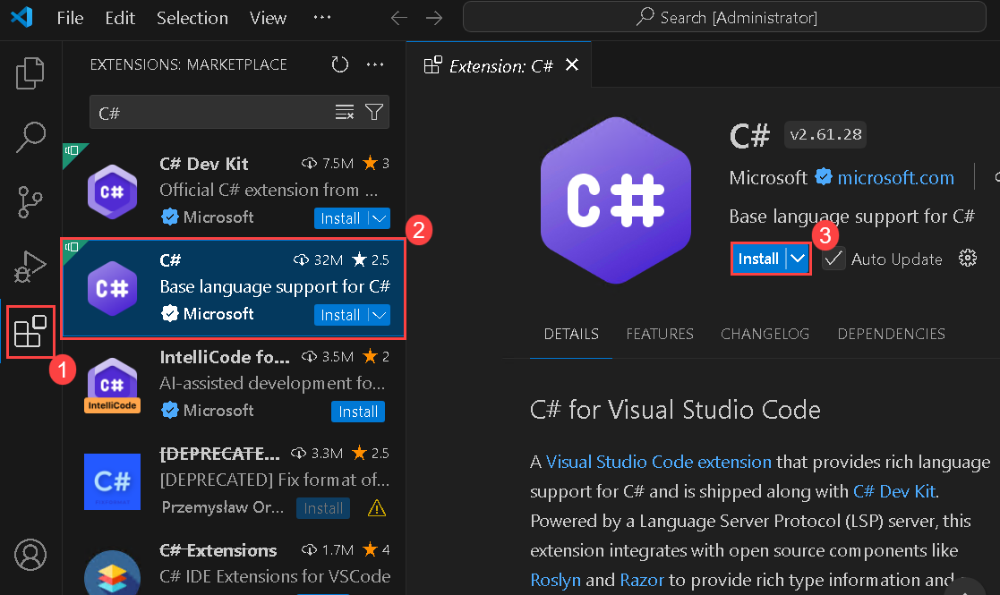
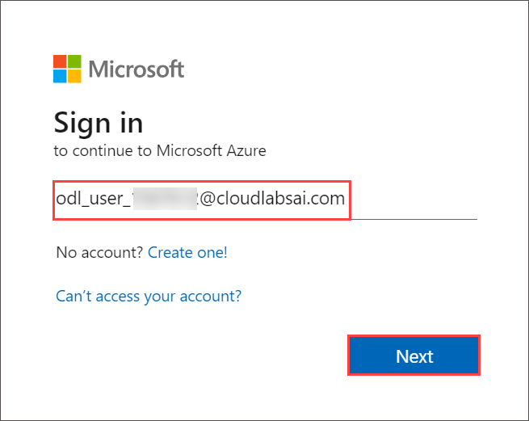
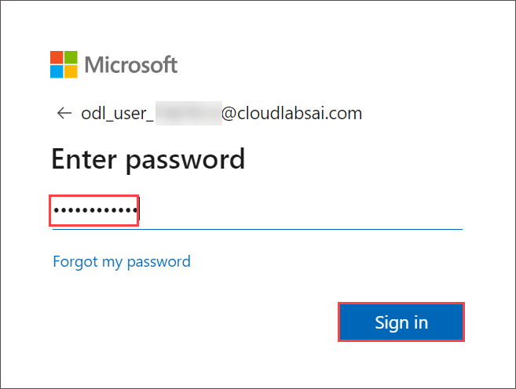
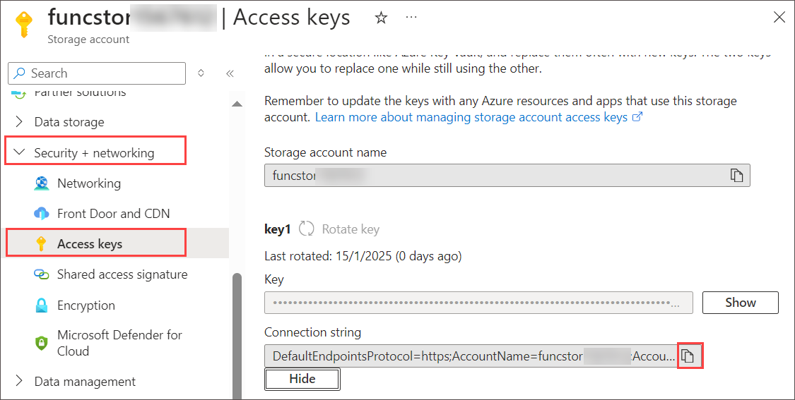

# Lab 02: Implement task processing logic by using Azure Functions

## Lab Scenario

In this lab, you will demonstrate the ability to create a simple Azure function that echoes text that is entered and sent to the function by using HTTP POST commands. This will illustrate how the function can be triggered over HTTP. 

Additionally, you will demonstrate how to execute an Azure function by setting it to execute on a fixed schedule. The function will write a message to a log each time the schedule is triggered.

Finally, you will demonstrate how an Azure function can connect to other Azure resources, such as a storage account. The function will connect to a storage account that you create and return the contents of a file that is stored in the Azure storage account.

<em>View this video by right-clicking this **[video link](https://youtu.be/-3tneDvkYDo)** and select 'Open link in a new tab / new window'.</em>

## Lab objectives

In this lab, you will perform:

+ Exercise 1: Create Azure resources
+ Exercise 2: Configure a local Azure Functions project
+ Exercise 3: Create a function that's triggered by an HTTP request
+ Exercise 4: Create a function that triggers on a schedule
+ Exercise 5: Create a function that integrates with other services
+ Exercise 6: Deploy a local function project to an Azure Functions app
    
## Estimated timing: 60 minutes

## Architecture diagram


## Lab setup and pre-requisites

Before starting this lab, you must complete **Prerequisites** of this lab.

To install **C#** extension for this lab, follow the below steps in Visual Studio code:

1. Start Visual Studio Code.

     

2. Select the **Extensions (1)** blade from the left panel. Search with **C# (2)** and select **Install (3)** to install the extension.

    

4. After installing C# extensions, close the Visual Studio code.

## Exercise 1: Create Azure resources

In this exercise, you will create all the resources that you'll use in this lab.

### Task 1: Open the Azure portal

1. If you are not logged in already, click on **Azure portal** shortcut that is available on the desktop and log in with Azure credentials.

1. If not signed in, then on the **Sign into Microsoft Azure** tab you will see the login screen, in that enter the following **Email/Username** and then click on **Next**. 

   * Email/Username: <inject key="AzureAdUserEmail"></inject>
   
     
    
1. Now enter the following **Password** and click on **Sign in**.

   * Password: <inject key="AzureAdUserPassword"></inject>

     
    
1. If you see the pop-up **Stay Signed in?**, click No.

    

1. On the **Welcome to Microsoft Azure** page, click on **Cancel**.

    .png)

### Task 2: Create an Azure Storage account

1. In the Azure portal, use the **Search resources, services, and docs** text box to search for **Storage Accounts**, and then, in the list of results, select **Storage Accounts**.

   
   
1. On the **Storage accounts** blade, select **+ Create**.

1. On the **Create a storage account** blade, on the **Basics** tab, perform the following actions, and then select **Review + create**:

    | Setting                           | Action                                                       |
    | ----- | ----- |
    | **Subscription** drop-down list   | Retain the default value.                                    |
    | **Resource group** section        | Select **Serverless-<inject key="DeploymentID" enableCopy="false"/>** |
    | **Storage account name** text box | Enter **funcstor<inject key="DeploymentID" enableCopy="false"/>** |
    | **Region** drop-down list         | Select **(US) West US**.                                     |
    | **Primary service**               | No changes                                                   |
    | **Performance** section           | Select the **Standard** option.                              |
    | **Redundancy** drop-down list     | Select **Locally-redundant storage (LRS)**.                  |
    
    The following screenshot displays the configured settings in the **Create a storage account** blade.

    

1. On the **Review + create** tab, review the options that you selected during the previous steps.

1. Select **Create** to create the storage account by using your specified configuration.

    

   > **Note**: Wait for the creation task to complete before you proceed with this lab.

1. On the **Overview** blade, select the **Go to resource** button to navigate to the blade of the newly created storage account.

    
   
1. On the **Storage account** blade, in the **Security + networking** section, select **Access keys**.
   
1. On the **Access keys** blade, select **Show** to view the keys. Review any one of the keys, and then copy the value of either of the **Connection string** boxes to the clipboard.

     

   > **Note**: It doesn't matter which connection string you choose. They are interchangeable.

1. Open Notepad, and then paste the copied connection string value to Notepad. You'll use this value later in this lab.
   
    > **Congratulations** on completing the task! Now, it's time to validate it. Here are the steps:
   - Hit the Validate button for the corresponding task.
   - If you receive a success message, you can proceed to the next task.
   - If not, carefully read the error message and retry the step, following the instructions in the lab guide.
   - If you need any assistance, please contact us at labs-support@spektrasystems.com. We are available 24/7 to help you out.
 
   <validation step="a49bee64-9f5a-47c8-90df-f18d2763b428" /> 

### Task 3: Create a function app

1. In the Azure portal, use the **Search resources, services, and docs** text box to search for **Function App**, and then, in the list of results, select **Function App**.

    

1. On the **Function App** blade, select **+ Create**.

1. On the **Create Function App** blade, select **Consumption** and click on **Select**.

    

1. On the **Create Function App** blade, on the **Basics** tab, perform the following actions, and then select **Next: Storage**:

    | Setting | Action |
    | -- | -- |
    | **Subscription** drop-down list | Retain the default value |
    | **Resource group** section       | Select **Serverless-<inject key="DeploymentID" enableCopy="false"/>**|
    | **Function App name** text box   | Enter **funclogic<inject key="DeploymentID" enableCopy="false"/>** |
    | **Secure unique default hostname** | **Disabled** |
    | **Runtime stack** drop-down list | Select **.NET** |
    | **Version** drop-down list | Select **8 (LTS),  isolated worker model** |
    | **Region** drop-down list | Select the **West US** region |
    | **Operating System** option | Select **Linux** |

    

1. On the **Storage** tab, perform the following actions, and then select **Review + create**:

    | Setting                            | Action                                             |
    | ---------------------------------- | -------------------------------------------------- |
    | **Storage account** drop-down list | Select the **funcstor<inject key="DeploymentID" enableCopy="false"/>** storage account. |

    

1. On the **Review + create** tab, review the options that you selected during the previous steps.

1. Select **Create** to create the function app by using your specified configuration.

    

    > **Note**: Wait for the creation task to complete before you move forward with this lab.
 
    > **Congratulations** on completing the task! Now, it's time to validate it. Here are the steps:
   - Hit the Validate button for the corresponding task.
   - If you receive a success message, you can proceed to the next task.
   - If not, carefully read the error message and retry the step, following the instructions in the lab guide.
   - If you need any assistance, please contact us at labs-support@spektrasystems.com. We are available 24/7 to help you out.
 
   <validation step="662171f3-ea08-4da7-aecf-460ac004067b" />


### Review
In this exercise, you created all the resources that you'll use in this lab.

## Exercise 2: Configure a local Azure Functions project
Configuring a local Azure Functions project involves setting up a development environment on your local machine to create, test and debug Azure Functions before deploying them to the cloud.

### Task 1: Initialize a function project

1. On the taskbar, select the **Command prompt** icon.

1. Run the following command to change the current directory to the *C:\\AllFiles\AZ-204-DevelopingSolutionsforMicrosoftAzure-master\\Allfiles\\Labs\\02\\Starter\\func** empty directory:

    ```PowerShell
    cd C:\AllFiles\AZ-204-DevelopingSolutionsforMicrosoftAzure-master\Allfiles\Labs\02\Starter\func
    ```

1. Run the following command to upgrade to the latest version of **Azure Functions Core Tools**.

    ```
    choco upgrade azure-functions-core-tools
    ```

1. Run the following command to use the **Azure Functions Core Tools** to create a new local Azure Functions project in the current directory using the **dotnet-isolated** runtime:
    
    ```PowerShell
     func init --worker-runtime dotnet-isolated --target-framework net8.0 --force
    ```
     
    > **Note**: You can review the documentation to [start the function app project locally](https://docs.microsoft.com/azure/azure-functions/functions-develop-local) using the **Azure Functions Core Tools**.
    
1. Close the **Command prompt** application.

### Task 2: Configure a connection string

1. On the **Start** screen, select the **Visual Studio Code** tile.
1. On the **File** menu, select **Open Folder**.
1. In the **File Explorer** window that opens, browse to **C:\AllFiles\AZ-204-DevelopingSolutionsforMicrosoftAzure-master\Allfiles\Labs\02\Starter\func**, and then select **Select Folder**.
1. On the **Visual Studio Code** pop-up select **Yes, I trust the authors**.
1. On the **Explorer** pane of the **Visual Studio Code** window, open the **local.settings.json** file.
1. Observe the current value of the **AzureWebJobsStorage** setting:

    ```json
    "AzureWebJobsStorage": "UseDevelopmentStorage=true",
    ```

1. Change the value of the **AzureWebJobsStorage** element to the **connection string** of the storage account that you recorded earlier in this lab.
1. Save the **local.settings.json** file.

### Task 3: Build and validate a project

1. On the taskbar, select the **Terminal -\> New Terminal**.
1. Run the following command to change the current directory to the *C:\AllFiles\AZ-204-DevelopingSolutionsforMicrosoftAzure-master\Allfiles\Labs\02\Starter\func** empty directory:

    ```PowerShell
    cd C:\AllFiles\AZ-204-DevelopingSolutionsforMicrosoftAzure-master\Allfiles\Labs\02\Starter\func
    ```

1. Run the following command to **build** the .NET project:

    ```PowerShell
    dotnet build
    ```

1. Select **Kill Terminal** or the **Recycle Bin** icon to close the currently open terminal and any associated processes.

### Review
In this exercise, you created a local project that you'll use for Azure Functions development.

## Exercise 3: Create a function that's triggered by an HTTP request

In this exercise, you will create a basic function that echoes the content sent through an HTTP POST request.

### Task 1: Create an HTTP-triggered function

1. On the taskbar, select the **Terminal -\> New Terminal**.

1. Run the following command to change the current directory to the **C:\AllFiles\AZ-204-DevelopingSolutionsforMicrosoftAzure-master\Allfiles\Labs\02\Starter\func**:

    ```PowerShell
    cd C:\AllFiles\AZ-204-DevelopingSolutionsforMicrosoftAzure-master\Allfiles\Labs\02\Starter\func
    ```

1. Run the following command to use the **Azure Functions Core Tools** to create a new function named **Echo** using the **HTTP trigger** template:

    ```PowerShell
    func new --template "HTTP trigger" --name "Echo"
    ```

    > **Note**: You can review the documentation to [start the function app project locally](https://docs.microsoft.com/azure/azure-functions/functions-develop-local) using the **Azure Functions Core Tools**.

1. Close the currently running **Terminal** application.

### Task 2: Write HTTP-triggered function code

1. On the **Explorer** pane of the **Visual Studio Code** window, open the **Echo.cs** file.
   
1. Delete all the content within the **Echo.cs** file, and add the following code. It defines an HTTP-triggered function called "Echo" which takes in a POST request and returns the request body. The ILogger interface is also used to log information. This function can be used to test HTTP requests and responses.

    ```csharp
    using System.IO;
    using System.Net;
    using System.Threading.Tasks;
    using Microsoft.Azure.Functions.Worker;
    using Microsoft.Azure.Functions.Worker.Http;
    using Microsoft.Extensions.Logging;
     
    namespace func
    {
        public class Echo
        {
            private readonly ILogger _logger;
     
            public Echo(ILoggerFactory loggerFactory)
            {
                _logger = loggerFactory.CreateLogger<Echo>();
            }
     
            [Function("Echo")]
            public async Task<HttpResponseData> Run([HttpTrigger(AuthorizationLevel.Function, "get", "post")] HttpRequestData req)
            {
                _logger.LogInformation("C# HTTP trigger function processed a request.");
     
                var response = req.CreateResponse(HttpStatusCode.OK);
                response.Headers.Add("Content-Type", "text/plain; charset=utf-8");
     
                // Read the request body asynchronously
                string requestBody;
                using (StreamReader reader = new StreamReader(req.Body))
                {
                    requestBody = await reader.ReadToEndAsync();
                }
     
                // Write the response body asynchronously
                await response.WriteStringAsync(requestBody);
     
                return response;
            }
        }
    }
    ```

1. Select **Save** to save your changes to the **Echo.cs** file.

### Task 3: Test the HTTP-triggered function by using httprepl

1. On the taskbar, select the **Terminal -\> New Terminal**.
1. Run the following command to change the current directory to the **C:\AllFiles\AZ-204-DevelopingSolutionsforMicrosoftAzure-master\Allfiles\Labs\02\Starter\func** empty directory:

    ```PowerShell
    cd C:\AllFiles\AZ-204-DevelopingSolutionsforMicrosoftAzure-master\Allfiles\Labs\02\Starter\func
    ```

1. Run the following command to run the function app project:

    ```PowerShell
    func start --build
    ``` 

    > **Note**: You can review the documentation to [start the function app project locally](https://docs.microsoft.com/azure/azure-functions/functions-develop-local) using the **Azure Functions Core Tools**.
    
    
1. On the taskbar, select the **Command Prompt** icon again to open a new instance of the application.

1. Run the following command to run test the **POST** REST API call against `http://localhost:7071/api/echo` with HTTP request body set to a numeric value of **3**:

   ```cmd
   curl -X POST -i http://localhost:7071/api/echo -d 3
   ```

1. Run the following command to test the **POST** REST API call against `http://localhost:7071/api/echo` with HTTP request body set to a numeric value of **5**:

   ```cmd
   curl -X POST -i http://localhost:7071/api/echo -d 5
   ```

1. Run the following command to test the **POST** REST API call against `http://localhost:7071/api/echo` with HTTP request body set to a string value of **Hello**:

   ```cmd
   curl -X POST -i http://localhost:7071/api/echo -d "Hello"
   ```

1. Run the following command to test the **POST** REST API call against `http://localhost:7071/api/echo` with HTTP request body set to a JavaScript Object Notation (JSON) value of **{"msg": "Successful"}**:

   ```cmd
   curl -X POST -i http://localhost:7071/api/echo -d "{"msg": "Successful"}"
   ```

1. Close all currently running instances of the **Terminal** application, and the **Command Prompt** application.

1. Close all currently running instances of the **Command Prompt** application.
    
### Review

In this exercise, you created a basic function that echoes the content sent through an HTTP POST request.

## Exercise 4: Create a function that triggers on a schedule

In this exercise, you will create a function that runs automatically based on a fixed schedule.

### Task 1: Create a schedule-triggered function

1. On the taskbar, select the **Command Prompt** icon.

1. Run the following command to change the current directory to the **C:\AllFiles\AZ-204-DevelopingSolutionsforMicrosoftAzure-master\Allfiles\Labs\02\Starter\func** empty directory:

    ```PowerShell
    cd C:\AllFiles\AZ-204-DevelopingSolutionsforMicrosoftAzure-master\Allfiles\Labs\02\Starter\func
    ```

1. Within the terminal, run the following command to use the **Azure Functions Core Tools** to create a new function named **Recurring**, using the **Timer trigger** template:

    ```PowerShell
    func new --template "Timer trigger" --name "Recurring"
    ```

    > **Note**: You can review the documentation to [start the function app project locally](https://docs.microsoft.com/azure/azure-functions/functions-develop-local) using the **Azure Functions Core Tools**.
    
1. Close the currently running **Terminal** application.

### Task 2: Observe function code

1. On the **Start** screen, select the **Visual Studio Code** tile.
1. On the **File** menu, select **Open Folder**.
1. In the **File Explorer** window that opens, browse to **C:\AllFiles\AZ-204-DevelopingSolutionsforMicrosoftAzure-master\Allfiles\Labs\02\Starter\func**, and then select **Select Folder**.
1. On the **Explorer** pane of the **Visual Studio Code** window, open the **Recurring.cs** file.
1. In the code editor, observe the implementation:

    ```csharp
    using System;
    using Microsoft.Azure.Functions.Worker;
    using Microsoft.Extensions.Logging;

    namespace func
    {
        public class Recurring
        {
            private readonly ILogger _logger;

            public Recurring(ILoggerFactory loggerFactory)
            {
                _logger = loggerFactory.CreateLogger<Recurring>();
            }

            [Function("Recurring")]
            public void Run([TimerTrigger("0 */5 * * * *")] TimerInfo myTimer)
            {
                _logger.LogInformation($"C# Timer trigger function executed at: {DateTime.Now}");

                if (myTimer.ScheduleStatus is not null)
                {
                    _logger.LogInformation($"Next timer schedule at: {myTimer.ScheduleStatus.Next}");
                }
            }
        }
    }
    ```

1. In line 17, replace `"0 */5 * * * *"` with `"0 */1 * * * *"` to set the recurring frequency interval to 1 minute rather than 5 minutes and save the change.

### Task 3: Observe function runs

1. On the taskbar, select the **Command prompt** icon.

1. Run the following command to change the current directory to the **C:\AllFiles\AZ-204-DevelopingSolutionsforMicrosoftAzure-master\Allfiles\Labs\02\Starter\func** empty directory:

    ```PowerShell
    cd C:\AllFiles\AZ-204-DevelopingSolutionsforMicrosoftAzure-master\Allfiles\Labs\02\Starter\func
    ```

1. Within the Command prompt, run the following command to run the function app project:

    ```PowerShell
    func start --build
    ```

    > **Note**: You can review the documentation to [start the function app project locally](https://docs.microsoft.com/azure/azure-functions/functions-develop-local) using the **Azure Functions Core Tools**.
    
1. Observe the function run that occurs about every one minute. Each function run should render a simple message to the log.
1. Close the currently running **Command prompt** application.
1. Close the Visual Studio Code window.

### Review

In this exercise, you created a function that runs automatically based on a fixed schedule.

## Exercise 5: Create a function that integrates with other services

In this exercise, you created a function that returns the content of a JSON file in Storage.

### Task 1: Upload sample content to Azure Blob Storage

1. On the Azure portal's **navigation** pane, select the **Resource groups** link.
1. On the **Resource groups** blade, select the **Serverless-<inject key="DeploymentID" enableCopy="false"/>** resource group that you created previously in this lab.
1. On the **Serverless-<inject key="DeploymentID" enableCopy="false"/>** blade, select the **funcstor** storage account that you created previously in this lab.
1. On the **Storage account** blade, select the **Containers** link in the **Data storage** section.
1. In the **Containers** section, select **+ Container**.
1. In the **New container** pop-up window, perform the following actions, and then select **Create**:

    | Setting                          | Action                           |
    | -------------------------------- | -------------------------------- |
    | **Name** text box  | Enter **content**.     |
    | **Public access level** drop-down list  | Select **Private (no anonymous access)**.     |

1. Return to the **Containers** section, and then select the recently created **content** container.
1. On the **Container** blade, select **Upload**.
1. In the **Upload blob** window, perform the following actions, and then select **Upload**:

    | Setting                          | Action                           |
    | -------------------------------- | -------------------------------- |
    | **Files** section  | Select the **Folder** icon.    |
    | **File Explorer** window  | Browse to **C:\AllFiles\AZ-204-DevelopingSolutionsforMicrosoftAzure-master\Allfiles\Labs\02\Starter**, select the **settings.json** file, and then select **Open**.    |
    | **Overwrite if files already exist** check box  | Ensure that this check box is selected.   |

      > **Note**: Wait for the blob to upload before you continue with this lab.

### Task 2: Create an HTTP-triggered function

1. On the taskbar, select the **Command prompt** icon.

1. Run the following command to change the current directory to the **C:\AllFiles\AZ-204-DevelopingSolutionsforMicrosoftAzure-master\Allfiles\Labs\02\Starter\func** empty directory:

    ```PowerShell
    cd C:\AllFiles\AZ-204-DevelopingSolutionsforMicrosoftAzure-master\Allfiles\Labs\02\Starter\func
    ```

1. Within the terminal, run the following command to use the **Azure Functions Core Tools** to create a new function named **GetSettingInfo**, using the **HTTP trigger** template:

    ```PowerShell
    func new --template "HTTP trigger" --name "GetSettingInfo"
    ```

    > **Note**: You can review the documentation to [start the function app project locally](https://docs.microsoft.com/azure/azure-functions/functions-develop-local) using the **Azure Functions Core Tools**.

1. Close the currently running **Command prompt** application.

#### Task 3: Register Azure Storage Blob extensions

1. On the taskbar, select the **Terminal** icon.

1. Run the following command to change the current directory to the **C:\AllFiles\AZ-204-DevelopingSolutionsforMicrosoftAzure-master\Allfiles\Labs\02\Starter\func** directory:

    ```PowerShell
    cd C:\AllFiles\AZ-204-DevelopingSolutionsforMicrosoftAzure-master\Allfiles\Labs\02\Starter\func
    ```

1. Within the terminal, run the following command to register the [Microsoft.Azure.Functions.Worker.Extensions.Storage](https://www.nuget.org/packages/Microsoft.Azure.Functions.Worker.Extensions.Storage/6.2.0) extension:

    ```PowerShell
    dotnet add package Microsoft.Azure.Functions.Worker.Extensions.Storage --version 6.2.0
    ```

### Task 4: Write HTTP-triggered and blob-inputted function code

1. On the **Start** screen, select the **Visual Studio Code** tile.
1. On the **File** menu, select **Open Folder**.
1. In the **File Explorer** window that opens, browse to **C:\AllFiles\AZ-204-DevelopingSolutionsforMicrosoftAzure-master\Allfiles\Labs\02\Starter\func**, and then select **Select Folder**.

1. On the **Explorer** pane of the **Visual Studio Code** window, open the **host.json** file and replace with the below code.

   ```csharp
   {
    "version": "2.0",
    "logging": {
        "applicationInsights": {
            "samplingSettings": {
                "isEnabled": true,
                "excludedTypes": "Request"
            },
            "enableLiveMetricsFilters": true
        }
    },
    "http": {
        "allowSynchronousIO": true
    }
   }
   ```


1. On the **Explorer** pane of the **Visual Studio Code** window, open the **GetSettingInfo.cs** file.

1. Replace the existing code with the below code (this code returns the contents of a JSON file in an Azure Blob Storage container in response to an HTTP GET request):

    ```csharp
    using System.Net;
    using System.Threading.Tasks;
    using Microsoft.Azure.Functions.Worker;
    using Microsoft.Azure.Functions.Worker.Http;
    using Microsoft.Extensions.Logging;
    
    namespace func
    {
        public class GetSettingInfo
        {
            private readonly ILogger _logger;
    
            public GetSettingInfo(ILoggerFactory loggerFactory)
            {
                _logger = loggerFactory.CreateLogger<GetSettingInfo>();
            }
    
            [Function("GetSettingInfo")]
            public async Task<HttpResponseData> Run(
                [HttpTrigger(AuthorizationLevel.Function, "get", "post")] HttpRequestData req,
                [BlobInput("content/settings.json", Connection = "AzureWebJobsStorage")] string blobContent
            )
            {
                _logger.LogInformation("C# HTTP trigger function processed a request.");
                _logger.LogInformation($"{blobContent}");
    
                var response = req.CreateResponse(HttpStatusCode.OK);
                response.Headers.Add("Content-Type", "text/plain; charset=utf-8");
                
                // Use asynchronous method instead of synchronous
                await response.WriteStringAsync($"{blobContent}");
    
                return response;
            }
        }
    }
    ```

1. Use **Ctrl + S** to save your changes to the **GetSettingInfo.cs** file.

### Task 5: Test the function by using httprepl

1. On the taskbar, select the **Terminal** icon.

1. Run the following command to change the current directory to the **C:\AllFiles\AZ-204-DevelopingSolutionsforMicrosoftAzure-master\Allfiles\Labs\02\Starter\func** empty directory:

    ```PowerShell
    cd C:\AllFiles\AZ-204-DevelopingSolutionsforMicrosoftAzure-master\Allfiles\Labs\02\Starter\func
    ```

1. Within the terminal, run the following command to run the function app project:

    ```PowerShell
    func start --build
    ```

    > **Note**: You can review the documentation to [start the function app project locally](https://docs.microsoft.com/azure/azure-functions/functions-develop-local) using the **Azure Functions Core Tools**.

1. On the taskbar, select the **Command Prompt** icon again to open a new instance of the **Command Prompt** application.

1. Run the following command to test the **GET** REST API call against `http://localhost:7071/api/GetSettingInfo`:

   ```cmd
   curl -X GET -i http://localhost:7071/api/GetSettingInfo
   ```
1. Observe the JSON content of the response from the function app, which should now include:

    ```json
    {
        "version": "0.2.4",
        "root": "/usr/libexec/mews_principal/",
        "device": {
            "id": "21e46d2b2b926cba031a23c6919"
        },
        "notifications": {
            "email": "joseph.price@contoso.com",
            "phone": "(425) 555-0162 x4151"
        }
    }
    ```

1. Run the following command to exit the **httprepl** application:

    ```powershell
    exit
    ```

1. Close all currently running instances of the **Command Prompt** application.

### Review
In this exercise, you created a function that returns the content of a JSON file in Storage.

## Exercise 6: Deploy a local function project to an Azure Functions app

In this exercise, you deploy a local function project to Azure Functions and validate that the functions work in Azure.

### Task 1: Deploy using the Azure Functions Core Tools

1. On the taskbar, select the **Terminal** icon.
1. Run the following command to change the current directory to the **C:\AllFiles\AZ-204-DevelopingSolutionsforMicrosoftAzure-master\Allfiles\Labs\02\Starter\func** empty directory:

    ```PowerShell
    cd C:\AllFiles\AZ-204-DevelopingSolutionsforMicrosoftAzure-master\Allfiles\Labs\02\Starter\func
    ```

1. From the command prompt, run the following command to log in to the Azure Command-Line Interface (CLI):

    ```PowerShell
    az login
    ```

1. In the **Microsoft Edge** browser window, enter the name and password of the Microsoft or Azure Active Directory account you are using in this lab, and then select **Sign in**.

1. Return to the currently open **Terminal** window. Wait for the sign-in process to finish.

1. Within the terminal, run the following command to publish the function app project (replace the `<function-app-name>` placeholder with the name of the function app you created earlier in this lab):

    ```PowerShell
    func azure functionapp publish <function-app-name> --dotnet-version 8.0
    ```

    > **Note**: You can copy the following Function App name as created in this lab, **funclogic<inject key="DeploymentID" enableCopy="true"/>** and replace it in the above command.
    
    > **Note**: For example, if your **Function App name** is **funclogic4532**, your command would be ``func azure functionapp publish funclogic4532``.     
    
    > **Note**: You can review the documentation to [start the function app project locally](https://docs.microsoft.com/azure/azure-functions/functions-develop-local) using the **Azure Functions Core Tools**.

1. Wait for the deployment to finalize before you move forward with the lab.
1. Close the currently running **Terminal** application.

### Task 2: Validate deployment

1. On the taskbar, select the **Microsoft Edge** icon, and select the tab that displays the Azure portal.
2. On the Azure portal's **navigation** pane, select the **Resource groups** link.
1. On the **Resource groups** blade, select the **Serverless-<inject key="DeploymentID" enableCopy="false"/>** resource group that you created previously in this lab.
1. On the **Serverless-<inject key="DeploymentID" enableCopy="false"/>** blade, select the **funclogic<inject key="DeploymentID" enableCopy="false"/>** function app that you created previously in this lab.
5. On the **Overview** blade in Function App, select the **Functions** pane.
6. On the **Functions** pane, select the existing **GetSettingInfo** function.
7. In the **Function** blade, select the **Code + Test** option in the **Developer** section.
8. In the function editor, select **Test/Run**.
9. In the automatically displayed pane, in the **HTTP method** drop-down list, select **GET**.
10. Select **Run** to test the function.
11. In the **HTTP response content**, review the results of the test run. The JSON content should now include the following code:

    ```json
    {
        "version": "0.2.4",
        "root": "/usr/libexec/mews_principal/",
        "device": {
            "id": "21e46d2b2b926cba031a23c6919"
        },
        "notifications": {
            "email": "joseph.price@contoso.com",
            "phone": "(425) 555-0162 x4151"
        }
    }
    ```
    The following screenshot displays the Output.

    
    
    > **Note**: Ignore the message("Application Insights is not configured. Go to the Monitor tab and configure Application Insights to capture function logs.")
    
    > **Congratulations** on completing the task! Now, it's time to validate it. Here are the steps:
   - Hit the Validate button for the corresponding task.
   - If you receive a success message, you can proceed to the next task.
   - If not, carefully read the error message and retry the step, following the instructions in the lab guide.
   - If you need any assistance, please contact us at labs-support@spektrasystems.com. We are available 24/7 to help you out.
 
   <validation step="37713890-3096-441c-854c-2441f102e34f" />

### Review
In this exercise, you deployed a local function project to Azure Functions and validated that the functions work in Azure.

## You have successfully completed the lab
