# Lab 05: Deploy compute workloads by using images and containers

## Lab Scenario

In this lab, you will explore how to create and deploy containers to the Azure Container Registry using a .NET application and docker files. And also deploy a containerized solution to Azure Container Apps.

## Lab objectives

In this lab, you will perform:

+ Exercise 1: Create a VM by using the Azure Command-Line Interface (CLI)
+ Exercise 2: Create a Docker container image and deploy it to Azure Container Registry
+ Exercise 3: Deploy an Azure container instance
  
## Estimated timing: 60 minutes

## Architecture diagram


## Task 00: Lab setup and pre-requisites

Before starting this lab, you must complete the **Prerequisites** of this lab.

To install the **C#** extension for this lab, follow the below steps in Visual Studio code:

1. from the desktop, start **Visual Studio Code**.

     

2. Select the **Extensions (1)** blade from the left panel, search for **C# (2)** and select **Install (3)** to install the extension.

      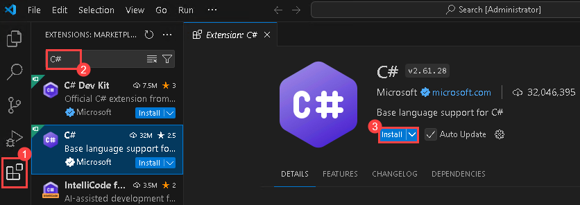

3. After installing the C# extension, close the Visual Studio code.

## Exercise 1: Create a VM by using the Azure Command-Line Interface (CLI)

In this exercise, you use Cloud Shell to create a VM as part of an automated script.

### Task 1: Open the Azure portal

1. If you are not logged in already, click on the **Azure portal** shortcut that is available on the desktop and log in with Azure credentials.

1. Enter the following **Email/Username** and then click on **Next**. 

   * Email/Username: <inject key="AzureAdUserEmail"></inject>
   
    
    
1. Now enter the following **Password** and click on **Sign in**.

   * Password: <inject key="AzureAdUserPassword"></inject>

     .png)
    
1. If you see the pop-up **Stay Signed in?**, click No.

    

### Task 2: Open Azure Cloud Shell

1. In the Azure portal, select the **Cloud Shell** icon .

      

      > **Note**: If you dont see the icon click on the three ellipses in the top right corner there in the drop you can see Cloudshell.

1. When prompted to select either Bash or PowerShell, select **Bash**.

      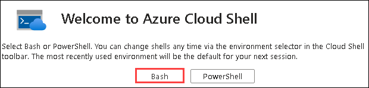

1. On the **Getting started** page, select the checkbox for **Mount storage account (1)**, select the **existing subscription (2)** and click on **Apply (3)**. 

      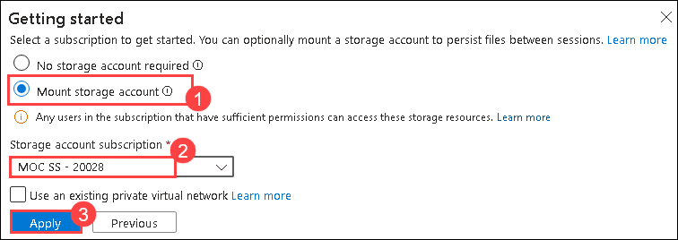

1. On the Mount storage account, select the checkbox for **I want to create a storage account (1)** and click on **Next (2)**.

      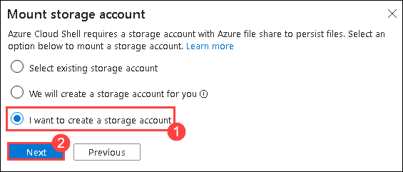

1. On the Create storage account page, provide the following details and click on **Create (6)**:

   - Select the default **Subscription (1)**
   - Select the existing **resource group (2)**
   - Region: **East US (3)**
   - Storage account name: **cloudstor<inject key="DeploymentID" enableCopy="false"/>**  **(4)**
   - File share: **blob<inject key="DeploymentID" enableCopy="false"/>** **(5)**

        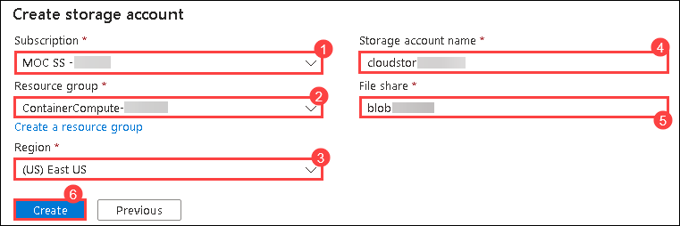

1.  At the **Cloud Shell** command prompt in the portal, run the following command to get the version of the Azure CLI tool:

    ```
    az --version
    ```

### Task 3: Use the Azure CLI commands

1.  Run the following command to get a list of subgroups and commands at the root level of the CLI:

    ```
    az --help
    ```

1.  Run the following command to get a list of subgroups and commands for Azure Virtual Machines:

    ```
    az vm --help
    ```

1.  Run the following command to get a list of arguments and examples for the **Create Virtual Machine** command:

    ```
    az vm create --help
    ```

1.  Run the following command to create a new **virtual machine**:

    ```
    az vm create --resource-group ContainerCompute-[deployId] --name quickvm --image Debian11 --admin-username student --admin-password StudentPa55w.rd
    ```
      > **Note**: Replace deployID with **<inject key="DeploymentID" enableCopy="false"/>**

      > **Note**: Wait for the VM to be created. After the process completes, the command will return a  JavaScript Object Notation (JSON) file containing details about the machine.

1.  Run the following command to get a more detailed JSON file that contains various metadata about the newly created VM:

    ```
    az vm show --resource-group ContainerCompute-[deployId] --name quickvm
    ```
      > **Note**: Replace deployID with **<inject key="DeploymentID" enableCopy="false"/>**
    
1.  Run the following command to list all the IP addresses associated with the VM:

    ```
    az vm list-ip-addresses --resource-group ContainerCompute-[deployId] --name quickvm
    ```
      > **Note**: Replace deployID with **<inject key="DeploymentID" enableCopy="false"/>**
    
1.  Run the following command to filter the output to only return the first IP address value:

    ```
    az vm list-ip-addresses --resource-group ContainerCompute-[deployId] --name quickvm --query '[].{ip:virtualMachine.network.publicIpAddresses[0].ipAddress}' --output tsv
    ```
      > **Note**: Replace deployID with **<inject key="DeploymentID" enableCopy="false"/>**
    
1.  Run the following command to store the results of the previous command in a new Bash shell variable named *ipAddress*:

    ```
    ipAddress=$(az vm list-ip-addresses --resource-group ContainerCompute-[deployId] --name quickvm --query '[].{ip:virtualMachine.network.publicIpAddresses[0].ipAddress}' --output tsv)
    ```
      > **Note**: Replace deployID with **<inject key="DeploymentID" enableCopy="false"/>**
    
1.  Run the following command to render the value of the Bash shell variable *ipAddress*:

    ```
    echo $ipAddress
    ```

1.  Run the following command to connect to the VM that you created previously in this lab, by using the Secure Shell (SSH) tool and the IP address stored in the Bash shell variable *ipAddress*:

    ```
    ssh student@$ipAddress
    ```

1.  The SSH tool informs you that the authenticity of the host can’t be established and then asks if you want to continue connecting. Enter **yes**, and then select Enter to continue connecting to the VM.

1.  The SSH tool then asks for a password. Enter **StudentPa55w.rd**, and then select Enter to authenticate with the VM.

1.  After connecting to the VM by using SSH, run the following command to get metadata describing the Linux VM:

    ```
    uname -a
    ```

1.  Use the **exit** command to end your SSH session:

    ```
    exit
    ```

1.  Close the **Cloud Shell** pane in the portal.
     
    > **Congratulations** on completing the task! Now, it's time to validate it. Here are the steps:
   - Hit the Validate button for the corresponding task.
   - If you receive a success message, you can proceed to the next task.
   - If not, carefully read the error message and retry the step, following the instructions in the lab guide.
   - If you need any assistance, please contact us at labs-support@spektrasystems.com. We are available 24/7 to help you out.
 
   <validation step="35bcfc3c-0daa-49e1-a1e8-d2f44def391e" />

## Exercise 2: Create a Docker container image and deploy it to Azure Container Registry

In this exercise, you create a .NET console application to display a machine’s current IP address. You then add the **Dockerfile** file to the application so that it can be converted into a Docker container image. Finally, you deploy the container image to Container Registry.

### Task 1: Open the Cloud Shell and editor

1.  Close the existing **CloudShell** window and open a new shell instance from the Azure portal's navigation pane.

    > **Note**: Wait for CloudShell to finish connecting to an instance before moving on with the lab.

1. Click on the **Settings** button and select **Go to Classic Version**.

      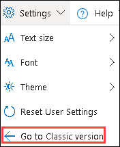

1.  At the **CloudShell** command prompt in the portal, run the following command to move from the root directory to the **\~/clouddrive** directory:

    ```
    cd ~/clouddrive
    ```

1.  Run the following command to create a new directory named **ipcheck** in the **\~/clouddrive** directory:

    ```
    mkdir ipcheck
    ```

1.  Run the following command to change the active directory from **\~/clouddrive** to **\~/clouddrive/ipcheck**:

    ```
    cd ~/clouddrive/ipcheck
    ```

1.  Run the following command to create a new .NET console application in the current directory:

    ```
    dotnet new console --output . --name ipcheck --framework net8.0
    ```

1.  Run the following command to create a new file in the **\~/clouddrive/ipcheck** directory named **Dockerfile**:

    ```
    touch Dockerfile
    ```

1.  Run the following command to open the embedded graphical editor in the context of the current directory:

    ```
    code .
    ```

### Task 2: Create and test a .NET application

1.  In the graphical editor, on the **FILES** pane, select the **Program.cs** file to open it in the editor.

1.  Delete the entire content of the **Program.cs** file.

1.  Copy and paste the following code into the **Program.cs** file:

    ```csharp
    public class Program
    {
        public static void Main(string[] args)
        {        
            // Check if network is available
            if (System.Net.NetworkInformation.NetworkInterface.GetIsNetworkAvailable())
            {
                System.Console.WriteLine("Current IP Addresses:");

                // Get host entry for current hostname
                string hostname = System.Net.Dns.GetHostName();
                System.Net.IPHostEntry host = System.Net.Dns.GetHostEntry(hostname);
                
                // Iterate over each IP address and render their values
                foreach(System.Net.IPAddress address in host.AddressList)
                {
                    System.Console.WriteLine($"\t{address}");
                }
            }
            else
            {
                System.Console.WriteLine("No Network Connection");
            }
        }
    }
    ```

1.  Save the **Program.cs** file by using the menu in the graphical editor or the Ctrl+S keyboard shortcut.  Don't close the graphical editor.

1.  Back at the command prompt, run the following command to run the application:

    ```
    dotnet run
    ```

1.  Review the results of the run. At least one IP address should be listed for the Cloud Shell instance.

1.  In the graphical editor, on the **FILES** pane of the editor, select the **Dockerfile** file to open it in the editor.

1.  Copy and paste the following code into the **Dockerfile** file:

    ```
    # Start using the .NET 8.0 SDK container image
    FROM mcr.microsoft.com/dotnet/sdk:8.0 AS build

    # Change current working directory
    WORKDIR /app

    # Copy existing files from host machine
    COPY . ./

    # Publish application to the "out" folder
    RUN dotnet publish --configuration Release --output out

    # Start container by running application DLL
    ENTRYPOINT ["dotnet", "out/ipcheck.dll"]
    ```

1.  Save the **Dockerfile** file by using the menu in the graphical editor or by using the Ctrl+S keyboard shortcut and close the editor.

### Task 3: Create a Container Registry resource

1. At the **Cloud Shell** command prompt in the portal, type `Ctrl+C` and run the following command to create a variable with a unique value for the Container Registry resource: 

    ```bash
    registryName=conregistry$RANDOM
    ```

1. At the **Cloud Shell** command prompt in the portal, run the following command to verify the name created in the previous step is available: 

    ```bash
    az acr check-name --name $registryName
    ```

      > **Note**: If the results show the name is available, continue to the next step. If the name is not available then re-run the command in the previous step and verify availability again.

1. At the **Cloud Shell** command prompt in the portal, run the following command to create a Container Registry resource: 

    ```bash
    az acr create --resource-group ContainerCompute-[deployId] --name $registryName --sku Basic
    ```

    > **Note**: Replace deployID with **<inject key="DeploymentID" enableCopy="false"/>**
    
    > **Note**: Wait for the creation task to complete before you continue with this lab.

### Task 4: Open Azure Cloud Shell and store Container Registry metadata

1.  At the **Cloud Shell** command prompt in the portal, type `Ctrl+C` and select the **CloudShell** icon to open a new shell instance.  

    > **Note**: Wait for Cloud Shell to finish connecting to an instance before moving forward with the lab.

1.  At the **Cloud Shell** command prompt in the portal, run the following command to get a list of all container registries in your subscription:

    ```
    az acr list
    ```

1.  Run the following command, ensuring you see the name of your registry as output. If you see no output other than '[]', wait a minute and try running the command again:

    ```
    az acr list --query "max_by([], &creationDate).name" --output tsv
    ```

1.  Run the following command:

    ```
    acrName=$(az acr list --query "max_by([], &creationDate).name" --output tsv)
    ```

1.  Run the following command:

    ```
    echo $acrName
    ```

### Task 5: Deploy a Docker container image to Container Registry

1.  Run the following command to change the active directory from **\~/** to **\~/clouddrive/ipcheck**:

    ```
    cd ~/clouddrive/ipcheck
    ```

1.  Run the following command to get the contents of the current directory:

    ```
    dir
    ```

1.  Run the following command to upload the source code to your container registry and build the container image as a Container Registry task:

    ```
    az acr build --registry $acrName --image ipcheck:latest .
    ```

    > **Note**: Wait for the build task to complete before moving forward with this lab.

1.  Close the **Cloud Shell** pane in the portal.

### Task 6: Validate your container image in Container Registry

1. In the Azure portal, use the **Search resources, services, and docs** text box to search for **Container Registries** and select it.

      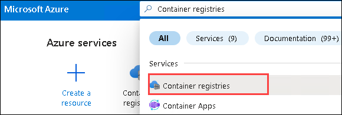

1. Open the **Container registry** that you have created.

1.  From the **Container Registry** blade, in the **Services** section, select the **Repositories (1)**. In the **Repositories** section, select the **ipcheck (2)** container image repository.

      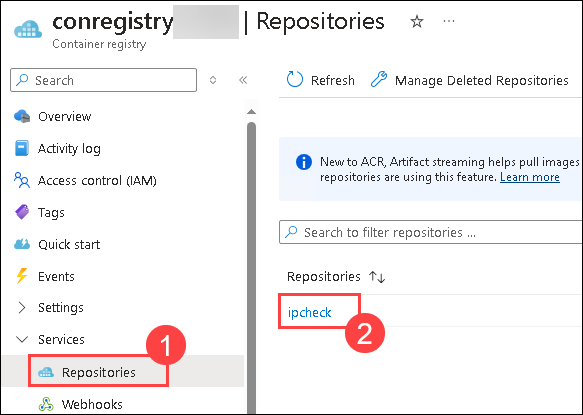

1.  Select the **latest** tag and review the metadata for the version of your container image with the **latest** tag.

    > **Note**: You can also select the **Run ID** link to find metadata about the build task.

    > **Congratulations** on completing the task! Now, it's time to validate it. Here are the steps:
   - Hit the Validate button for the corresponding task.
   - If you receive a success message, you can proceed to the next task.
   - If not, carefully read the error message and retry the step, following the instructions in the lab guide.
   - If you need any assistance, please contact us at labs-support@spektrasystems.com. We are available 24/7 to help you out.
 
   <validation step="fe05ecb6-098f-4894-bf7b-67a2fbf73671" />

## Exercise 3: Deploy an Azure container instance

In this exercise, you use multiple methods to deploy a container image to an Azure container instance. By using the manual method, you will be able to customize the deployment further and run task-based applications as part of a container run.

### Task 1: Enable the admin user in Container Registry

1. Navigate back to **Home > Container registries > Container registry** (previously created).

      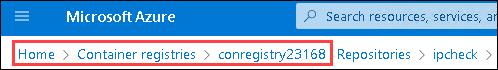
   
1.  On the **Access Keys** blade, in the **Admin user** section, select the **checkbox**.

      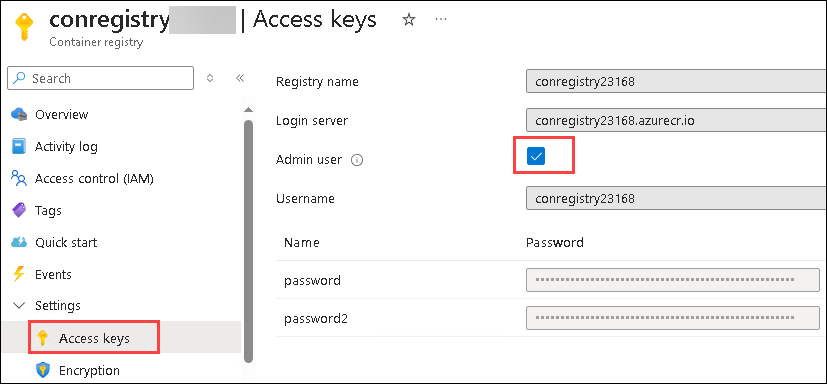

1.  Wait until you receive the notification confirming the successful enabling of the admin user.

### Task 2: Automatically deploy a container image to an Azure container instance

1.  On the **Container Registry** blade, in the **Services** section, select the **Repositories**.

1.  In the **Repositories** section, select the **ipcheck** container image repository.

1.  On the **Repository** blade, select the ellipsis menu associated with the **latest** tag entry, and then select **Run instance**(Click on **...** right side of the latest row).
    
    
    
1.  On the **Create container instance** blade, perform the following actions, and then select **Create**:

    | Setting                            | Action                       |
    | ---------------------------------- | ---------------------------- |
    | **Container name** text box        | Enter **managedcompute**     |
    | **Container image** text box       | Retain the default value.    |
    | **OS type** section                | Select **Linux**.            |
    | **Subscription** text box          | Retain the default value.    |
    | **Resource group** drop-down list  | Select **ContainerCompute-<inject key="DeploymentID" enableCopy="false"/>** |  
    | **Location** drop-down list        | Select **East US**.          |
    | **Number of cores** drop-down list | Select **2**.                |
    | **Memory (GB)** text box           | Enter **4**.                 |
    | **Public IP address** section      | Select **No**.               |

    

    > **Note**: Wait for the container instance to be created before you continue with this lab.

### Task 3: Manually deploy a container image to Container Instances

1. In the Azure portal, use the **Search resources, services, and docs** text box to search for **Container Instances**, and then in the list of results, select **Container Instances**.

1.  On the **Container Instances** blade, select **+ Create**.

1.  On the **Create Container Instance** blade, on the **Basics** tab, perform the following actions, and then select **Review + create**:

      | Setting                                | Action                                                       |
      | ---------------------------------      | ------------------------------------------------------------ |
      | **Subscription** drop-down list        | Retain the default value.                                    |
      | **Resource group** drop-down list      | Select **ContainerCompute-<inject key="DeploymentID" enableCopy="false"/>**.                      |
      | **Container name** text box            | Enter **manualcompute**                                      |
      | **Region** drop-down list              | Select **(US) East US**.                                     |
      | **Image source** section               | Select **Azure container registry**.                      |
     
    > **Note**: After selecting Azure container registry, verify Registry, Image and Image tag are automatically populated with the one which we created in the previous task.

1. Click on **Next: Networking** and ensure the Networking type is set to **Public**.

1. Click on **Next: Monitoring** and uncheck the option for **Enable container instance logs**.

1. Click on **Review + Create** and review the selected options.

1. Select **Create** to create the container instance by using your specified configuration.  

      > **Note**: Wait for the container instance to be created before you continue with this lab.

### Task 4: Validate that the container instance ran successfully

1. Click on **Go to resource**.

1. Under the Settings pane, in the **Containers (1)** section, review the list of **Events (2)**.

    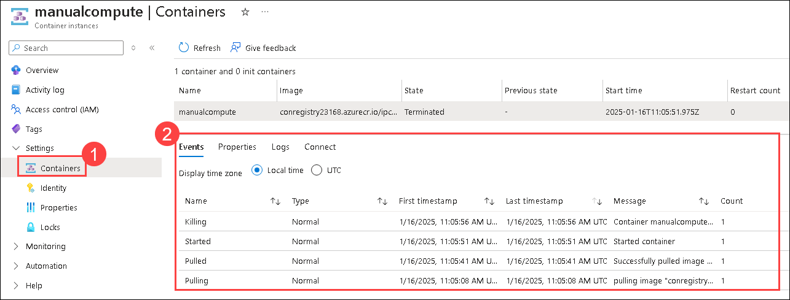

    > **Note**: After the application finishes running, the container terminates because it has completed its work. For the manually created container instance, you indicated that a successful exit was acceptable, so the container ran once. The automatically created instance didn't offer this option, and it assumes the container should always be running, so you'll notice repeated restarts of the container.
    
    > **Congratulations** on completing the task! Now, it's time to validate it. Here are the steps:
   - Hit the Validate button for the corresponding task.
   - If you receive a success message, you can proceed to the next task.
   - If not, carefully read the error message and retry the step, following the instructions in the lab guide.
   - If you need any assistance, please contact us at labs-support@spektrasystems.com. We are available 24/7 to help you out.
 
   <validation step="fda828e6-ed30-434d-8ae6-8498e1fb52bb" />

### Review
In this exercise, you used multiple methods to deploy a container image to an Azure container instance. By using the manual method, you were able to customize the deployment further and run task-based applications as part of a container run.

### You have successfully completed the lab
