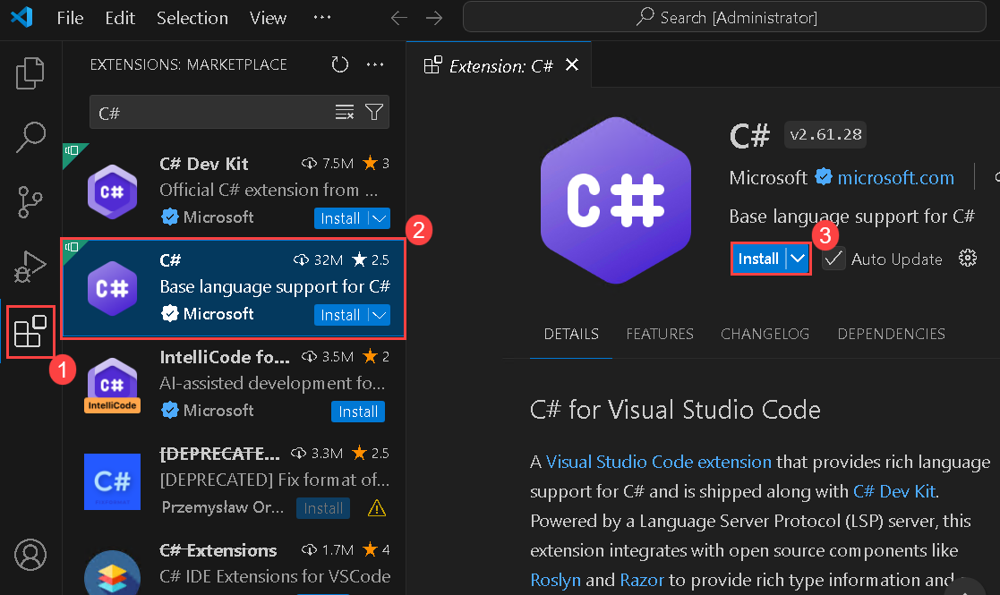
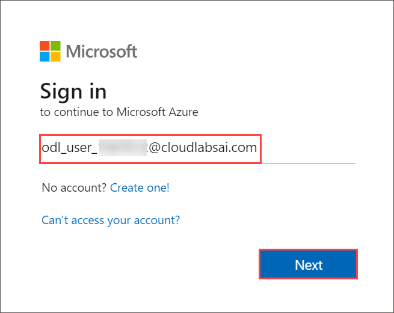
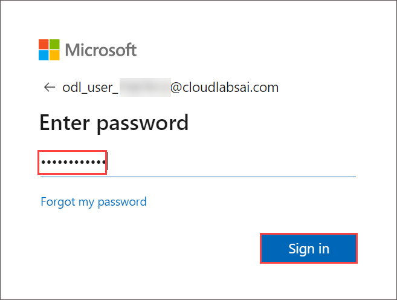

# Lab 07: Access resource secrets more securely across services

## Lab Scenario

In this lab, you will create a storage account and an Azure Function app that will access the storage account. To demonstrate the secure storage of connection string information, you will provision a Key Vault resource and manage the appropriate secrets to store the connection string information. You will also manage the service identity to gain secure access to the connection string information for the storage account.

## Lab objectives

In this lab, you will perform:

+ Exercise 1: Create Azure resources
+ Exercise 2: Configure secrets and identities
+ Exercise 3: Build an Azure Functions app
+ Exercise 4: Access Azure Blob Storage data
   
## Estimated timing: 60 minutes

## Architecture diagram


## Lab setup and pre-requisites

Before starting this lab, you must complete **Prerequisites** of this lab.

To install the **C#** extension for this lab, follow the below steps in Visual Studio code:

1. Start Visual Studio Code.

     

2. Select the **Extensions (1)** blade from the left panel. Search with **C# (2)** and select **Install (3)** to install the extension.

    

4. After installing C# extensions, close the Visual Studio code.

## Exercise 1: Create Azure resources

In this exercise, you create all the resources that you'll use in this lab.

### Task 1: Open the Azure portal

1. If you are not logged in already, click on the **Azure portal** shortcut that is available on the desktop and log in with Azure credentials.

1. If not signed in, then on the **Sign into Microsoft Azure** tab you will see the login screen, in that enter the following **Email/Username** and then click on **Next**. 

   * Email/Username: <inject key="AzureAdUserEmail"></inject>
   
     
    
1. Now enter the following **Password** and click on **Sign in**.

   * Password: <inject key="AzureAdUserPassword"></inject>

     
    
1. If you see the pop-up **Stay Signed in?**, click No.

    

1. On the **Welcome to Microsoft Azure** page, click on **Cancel**.

    .png)

### Task 2: Create a Storage account

1. In the Azure portal, use the **Search resources, services, and docs** text box to search for **Storage Accounts**, and then in the list of results, select **Storage accounts**.

1. On the **Storage accounts** blade, select **+ Create**.

1. On the **Create a storage account** blade, on the **Basics** tab, perform the following actions:

   | Setting                           | Action                                                       |
   | --------------------------------- | ------------------------------------------------------------ |
   | **Subscription** drop-down list   | Retain the default value.                                    |
   | **Resource group** section        | Select **ConfidentialStack-<inject key="DeploymentID" enableCopy="false"/>** |
   | **Storage account name** text box | Enter **securestor<inject key="DeploymentID" enableCopy="false"/>** |
   | **Region** drop-down list         | Select **(US) Central US**.                                     |
   | **Primary service**               | No changes |
   | **Performance** section           | Select the **Standard** option.                              |
   | **Redundancy** drop-down list     | select **Locally-redundant storage (LRS)**.                  |

   The following screenshot displays the configured settings on the **Create a storage account** blade.

   .png)

1. On the **Advanced** tab, ensure **Allow enabling anonymous access on individual containers** is checked. Check the settings if they are not enabled, and then select **Review + create**.

1. On the **Review + create** tab, review the options that you selected during the previous steps.

1. Select **Create** to create the storage account by using your specified configuration.

    > **Note**: Wait for the creation task to complete before you move forward with this lab.

1. On the Deployment Overview blade, select **Go to resource**.

1. On **securestor<inject key="DeploymentID" enableCopy="false"/>** storage account instance, in the **Security + networking** section, select the **Access keys**.

1. In the **Access keys** section, select **Show keys**.

1. Select any one of the keys and record the value of the connection string in the notepad. You’ll use this value later in this lab.

    > **Note**: It doesn't matter which connection string you choose. They're interchangeable.

### Task 3: Create an Azure Key Vault

1. In the Azure portal, use the **Search resources, services, and docs** text box to search for **Key vaults**, and then in the list of results, select **Key vaults**.

2. On the **Key vaults** blade, select **+ Create**.

3. On the **Create key vault** blade, on the **Basics** tab, perform the following actions, and then select **Access Configuration** tab:

   | Setting                           | Action                                    |
   | --------------------------------- | ----------------------------------------- |
   | **Subscription** drop-down list   | Retain the default value.                 |
   | **Resource group** drop-down list | Select **ConfidentialStack-<inject key="DeploymentID" enableCopy="false"/>** in the list. |
   | **Key vault name** text box       | Enter **securevault<inject key="DeploymentID" enableCopy="false"/>**        |
   | **Region** drop-down list         | Select **Central US**.                       |
   | **Pricing tier** drop-down list   | select **Standard**.                      |

   The following screenshot displays the configured settings on the **Create key vault** blade.

   

4. On the **Access Configuration** tab, change the permission model to **Vault access policy**.

5. Select the **Review + create** tab, and review the options that you selected during the previous steps.

6. Select **Create** to create the key vault by using your specified configuration.

    > **Note**: Wait for the creation task to complete before you move forward with this lab.

### Task 4: Create a Function app

1. In the Azure portal, use the **Search resources, services, and docs** text box to search for **Function App**, and then in the list of results, select **Function App**.

1. On the **Function App** blade, select **+ Create**.

1. On the **Select a hosting option** page, ensure **Consumption** is select, and then click **Select**.

1. On the **Create Function App (Consumption)** blade, on the **Basics** tab, perform the following actions, and then select **Next: Storage**:

   | Setting                           | Action                            |
   | --------------------------------- | --------------------------------- |
   | **Subscription** drop-down list   | Retain the default value.         |
   | **Resource group** drop-down list | Select **ConfidentialStack-<inject key="DeploymentID" enableCopy="false"/>** |
   | **Function App name** text box    | Enter **securefunc<inject key="DeploymentID" enableCopy="false"/>** |                 |
   | **Runtime stack** drop-down list  | Select **.NET**.                 |
   | **Version** drop-down list        | Select **8 (LTS), isolated worker model**.                   |
   | **Region** drop-down list         | Select the **Central US** region.    |
   | **Operating System** section       | Select **Linux**.                |

1. On the **Storage** tab, perform the following actions, and then select **Review + create**:

   | Setting                            | Action                                                 |
   | ---------------------------------- | ------------------------------------------------------ |
   | **Storage account** drop-down list | Select the **securestor<inject key="DeploymentID" enableCopy="false"/>** storage account. |

1. On the **Review + create** tab, review the options that you selected during the previous steps.

1. Select **Create** to create the function app by using your specified configuration.
 
### Review

In this exercise, you created all the resources that you'll use in this lab.

## Exercise 2: Configure secrets and identities

In this exercise, you create a system-assigned managed service identity for your function app and then give that identity the appropriate permissions to get the value of a secret in your key vault. Finally, you create a secret that you referenced within your function app's configuration settings.

### Task 1: Configure a system-assigned managed service identity

1. On the Azure portal's navigation pane, select the **Resource groups**.

1. On the **Resource groups** blade, select the **ConfidentialStack-<inject key="DeploymentID" enableCopy="false"/>** resource group.

1. On the **ConfidentialStack-<inject key="DeploymentID" enableCopy="false"/>** blade, select the **securefunc<inject key="DeploymentID" enableCopy="false"/>** function app.

   **Note:** There will be two resources, a function app and an application insights resource, with the same name. Make sure you select the function app resource.

1. On the **Function App** blade, select the **Identity** option from the **Settings** section.

1. On the **Identity** pane, on the **System assigned** tab, set the **Status** to **On**, and then select **Save**.

1. Select **Yes** to confirm the setting.

    > **Note**: Wait for the system-assigned managed identity to be created before you move forward with this lab.

    > **Note**: Wait for the creation task to complete before you move forward with this lab.
    
    > **Congratulations** on completing the task! Now, it's time to validate it. Here are the steps:
   - Hit the Validate button for the corresponding task.
   - If you receive a success message, you can proceed to the next task.
   - If not, carefully read the error message and retry the step, following the instructions in the lab guide.
   - If you need any assistance, please contact us at labs-support@spektrasystems.com. We are available 24/7 to help you out.
 
   <validation step="6857d179-1de8-442c-adc0-6872f7d04390" />

### Task 2: Create a Key Vault secret

1. On the Azure portal's **navigation** pane, select the **Resource groups**.

1. On the **Resource groups** blade, select the **ConfidentialStack-<inject key="DeploymentID" enableCopy="false"/>** resource group.

1. On the **ConfidentialStack-<inject key="DeploymentID" enableCopy="false"/>** blade, select the **securevault<inject key="DeploymentID" enableCopy="false"/>** key vault.

1. On the **Key Vault** blade, select the **Secrets** link in the **Objects** section.

1. On the **Secrets** pane, select **+ Generate/Import**.

1. On the **Create a secret** blade, perform the following actions, and then select **Create**:

   | Setting                            | Action                                             |
   | ---------------------------------- | -------------------------------------------------- |
   | **Upload options** drop-down list | Select **Manual**. |
   | **Name** text box       | Enter **storagecredentials**                                  |
   | **Secret value** text box       | Enter the storage account connection string that you recorded previously in this lab.               |
   | **Content type** text box | Leave blank. |
   | **Set activation date** check box | Not selected. |
   | **Set expiration date** check box | Not selected. |
   | **Enabled** option | Select **Yes**. |

   The following screenshot displays the configured settings on the **Create a secret** blade.

    

    > **Note**: Wait for the secret to be created before you move forward with this lab.

1. Return to the **Secrets** pane, and then select the **storagecredentials** item in the list.

1. On the **Versions** pane, select the latest version of the **storagecredentials** secret.

1. On the **Secret Version** pane, perform the following actions:

    i. Record the value of the **Secret Identifier** text box because you'll use this later in the lab.
    
    ii. Select **Show secret value** to find the value of the secret.

   > **Note**: You're recording the value of the **Secret Identifier** text box, not the **Secret Value** text box.

### Task 3: Configure a Key Vault access policy

1. On the Azure portal's navigation pane, select the **Resource groups**.

1. On the **Resource groups** blade, select the **ConfidentialStack-<inject key="DeploymentID" enableCopy="false"/>** resource group.

1. On the **ConfidentialStack-<inject key="DeploymentID" enableCopy="false"/>** blade, select the **securevault<inject key="DeploymentID" enableCopy="false"/>** key vault.

1. On the **Key vault** blade, select the **Access policies**.

1. On the **Access policies** pane, select **+ Create**.

1. On the **Create an access policy** blade, select **1 Permission** section and make the following selections then click **Next**:

   | Setting                            | Action                                             |
   | ---------------------------------- | -------------------------------------------------- |
   | **Configure from template** drop-down list | Leave blank. |
   | **Key permissions** drop-down list | 0 selected.      |
   | **Secret permissions** drop-down list | Select the **GET** permission. |
   | **Certificate permissions** drop-down list | 0 selected. |

   The following screenshot displays the configured settings in the **Create an access policy** blade.

    

1. On the **Principal** page, Select the Principal section and make the following selections:

   | Setting                            | Action                                             |
   | ---------------------------------- | -------------------------------------------------- | 
   | **Select principal link** | Find and then select the service principal named **securefunc<inject key="DeploymentID" enableCopy="false"/>**. The system-assigned managed identity you created previously in this lab will have the same name as the Azure Function resource. |

1. Select **Next** twice and select **Create**.

    > **Note**: Wait for your changes to the access policies to save before you continue with this lab.
    
    > **Congratulations** on completing the task! Now, it's time to validate it. Here are the steps:
   - Hit the Validate button for the corresponding task.
   - If you receive a success message, you can proceed to the next task.
   - If not, carefully read the error message and retry the step, following the instructions in the lab guide.
   - If you need any assistance, please contact us at labs-support@spektrasystems.com. We are available 24/7 to help you out.
 
   <validation step="005bb2cc-0f85-4d49-8919-d56c777df848" />

### Task 4: Create a Key Vault-derived application setting

1. On the Azure portal's navigation pane, select the **Resource groups**.

1. On the **Resource groups** blade, select the **ConfidentialStack-<inject key="DeploymentID" enableCopy="false"/>** resource group.

1. On the **ConfidentialStack-<inject key="DeploymentID" enableCopy="false"/>** blade, select the **securefunc<inject key="DeploymentID" enableCopy="false"/>** function app.

1. On the **Function App** blade, in the **Settings** section, select the **Environment variables** link.

1. In the **App settings** tab, select **+ Add**. Enter the following information in the **Add/Edit application setting** pop-up dialog:

    | Setting | Action |
    |--|--|
    | **Name** text box | Enter **StorageConnectionString** |
    | **Value** text box | Construct a value by using the following syntax: `@Microsoft.KeyVault(SecretUri=<Secret Identifier>)`, where the `<Secret Identifier>` placeholder represents the secret identifier you recorded earlier in this exercise. |
    | **Deployment slot setting** check box | Retain the default value |

    >**Note**: For example, if your secret identifier is `https://securevaultstudent.vault.azure.net/secrets/storagecredentials/17b41386df3e4191b92f089f5efb4cbf`, the resulting value would be `@Microsoft.KeyVault(SecretUri=https://securevaultstudent.vault.azure.net/secrets/storagecredentials/17b41386df3e4191b92f089f5efb4cbf)`.

1. Select **Apply** to close the pop-up dialog and return to the **App settings** section.

1. At the bottom of the **App settings** section, select **Apply**.

    >**Note:** You may receive a warning that your app may restart when updating app settings. Select **Confirm**. Wait for your application settings to save before you continue with the lab.

### Review

In this exercise, you created a system-assigned managed service identity for your function app and then gave that identity the appropriate permissions to get the value of a secret in your key vault. Finally, you created a secret that you referenced within your function app's configuration settings.

## Exercise 3: Build an Azure Functions app

In this exercise, you use a service identity to read the value of a secret stored in Key Vault and return that value as the result of a function app.

### Task 1: Initialize a function project

1. On the taskbar, Open the **Command prompt**.

1. Run the following command to change the current directory to the **Allfiles C:\AllFiles\AZ-204-DevelopingSolutionsforMicrosoftAzure-master\Allfiles\Labs\07\\Starter\\func** empty directory:

    ```PowerShell
    cd C:\AllFiles\AZ-204-DevelopingSolutionsforMicrosoftAzure-master\Allfiles\Labs\07\Starter\func
    ```

    > **Note**: In Windows Explorer remove the Read-only attribute from F:\Allfiles\Labs\07\Starter\func\.gitignore file.

1. Run the following command to use the **Azure Functions Core Tools** to create a new local Functions project in the current directory using the **dotnet** runtime:

   
    ```PowerShell
    func init --worker-runtime dotnet-isolated --target-framework net8.0 --force
    ```
    **Note :** If you see `'func' is not recognized` error, run the below command.

    ```PowerShell
    choco upgrade azure-functions-core-tools
    ```
    
    > **Note:** If you face any error or can't find the template in the location, try to run the below commands one after the other to uninstall and reinstall. 
    
    ```PowerShell
    choco uninstall azure-functions-core-tools
    ```

    ```PowerShell
    choco install azure-functions-core-tools
    ```

    >**Note**: If any error shows up That is related to "dotnet framework update" you can Install it using the link provided in the error. You can review the documentation to [create a new project][azure-functions-core-tools-new-project] using the **Azure Functions Core Tools**.

1. Run the following command to **build** the .NET 8 project:

    ```PowerShell
    dotnet build
    ```

### Task 2: Create an HTTP-triggered function

1. Run the following command to use the **Azure Functions Core Tools** to create a new function named **FileParser** using the **HTTP trigger** template:

    ```PowerShell
    func new --template "HTTP trigger" --name "FileParser"
    ```

    > **Note**: You can review the documentation to [create a new function][azure-functions-core-tools-new-function] using the **Azure Functions Core Tools**.

1. Close the currently running **Windows Terminal** application.

### Task 3: Configure and read an application setting

1. On the **Start** screen, select the **Visual Studio Code** tile.

1. On the **File** menu, select **Open Folder**.

1. In the **File Explorer** window that opens, browse to **Allfiles C:\AllFiles\AZ-204-DevelopingSolutionsforMicrosoftAzure-master\Allfiles\Labs\07\Starter**, and then select **func** and **Select Folder**.

1. On the **Visual Studio Code** pop-up select **Yes, I trust the authors**.

1. On the **Explorer** pane of the **Visual Studio Code** window, open the **local.settings.json** file.

1. Note the current value of the **Values** object:

    ```json
    "Values": {
    "AzureWebJobsStorage": "UseDevelopmentStorage=true",
    "FUNCTIONS_WORKER_RUNTIME": "dotnet-isolated"
    }
    ```

1. Update the value of the Values object by adding a new setting named **StorageConnectionString**, and then assigning it a string value of [TEST VALUE]:

    ```json
    "Values": {
    "AzureWebJobsStorage": "UseDevelopmentStorage=true",
    "FUNCTIONS_WORKER_RUNTIME": "dotnet-isolated",
    "StorageConnectionString": "[TEST VALUE]"
    }
    ```

1. The **local.settings.json** file should now include:

   ```json
    {
    "IsEncrypted": false,
    "Values": {
    "AzureWebJobsStorage": "UseDevelopmentStorage=true",
    "FUNCTIONS_WORKER_RUNTIME": "dotnet-isolated",
    "StorageConnectionString": "[TEST VALUE]"
        }
    }
   ```

1. Click on **Ctrl + s** to save your changes to the **local.settings.json** file.

1. On the **Explorer** pane of the **Visual Studio Code** window, open the **FileParser.cs** file.

1. Replace the code, which should consist of the following content (this code returns the value of the StorageConnectionString environment variable):

   ```csharp
    using System.Net;
    using Microsoft.Azure.Functions.Worker;
    using Microsoft.Azure.Functions.Worker.Http;
    using Microsoft.Extensions.Logging;

    namespace func
    {
        public class FileParser
        {
            private readonly ILogger _logger;

            public FileParser(ILoggerFactory loggerFactory)
            {
                _logger = loggerFactory.CreateLogger<FileParser>();
            }

            [Function("FileParser")]
            public async Task<HttpResponseData> Run(
                [HttpTrigger(AuthorizationLevel.Function, "get", "post")] HttpRequestData req)
            {
                _logger.LogInformation("C# HTTP trigger function processed a request.");

                var response = req.CreateResponse(HttpStatusCode.OK);
                response.Headers.Add("Content-Type", "text/plain; charset=utf-8");

                // Retrieve the connection string from environment variables
                string connectionString = Environment.GetEnvironmentVariable("StorageConnectionString");

                // Use asynchronous method to write the string to the response
                await response.WriteStringAsync(connectionString);

                return response;
            }
        }
    }
   ```

1. Click on **Ctrl + s** to save your changes to the **FileParser.cs** file.
  
### Task 4: Validate the local function

1. On the taskbar, select the **Command Prompt** icon.

1. Run the following command to change the current directory to the **Allfiles C:\AllFiles\AZ-204-DevelopingSolutionsforMicrosoftAzure-master\Allfiles\Labs\07\Starter\func** empty directory:

    ```PowerShell
    cd C:\AllFiles\AZ-204-DevelopingSolutionsforMicrosoftAzure-master\Allfiles\Labs\07\Starter\func
    ```

1. Run the following command to run the function app project:

    ```PowerShell
    func start --build
    ```

    > **Note**: You can review the documentation to [start the function app project locally][azure-functions-core-tools-start-function] using the **Azure Functions Core Tools**.

1. On the taskbar, select the **Command Prompt** icon again to open a new instance of the **Command Prompt** application.

1. When you receive the open command prompt, run the following command to install and start the **httprepl** tool, setting the base Uniform Resource Identifier (URI) to ``http://localhost:7071``:

    ```powershell
    dotnet tool install -g Microsoft.dotnet-httprepl
    ```
    
    ```powershell
    httprepl http://localhost:7071
    ```

    > **Note**: An error message is displayed by the **httprepl** tool. This message occurs because the tool is searching for a Swagger definition file to use to traverse the API. Because your function project doesn't produce a Swagger definition file, you'll need to traverse the API manually.

1. When you receive the tool prompt, run the following command to browse to the relative **api** directory:

    ```powershell
    cd api
    ```

1. Run the following command to browse to the relative **fileparser** directory:

    ```powershell
    cd fileparser
    ```

1. Run the following command to run the **get** command:

    ```powershell
    get
    ```

1. Observe the **[TEST VALUE]** value of the **StorageConnectionString** being returned as the result of the HTTP request:

    ```powershell
    HTTP/1.1 200 OK
    Content-Type: text/plain; charset=utf-8
    Date: Tue, 01 Sep 2020 23:35:39 GMT
    Server: Kestrel
    Transfer-Encoding: chunked

    [TEST VALUE]

    ```

1. Run the following command to exit the **httprepl** tool:

    ```powershell
    exit
    ```

1. Close all currently running instances of the **Command Prompt** application.

### Task 5: Deploy the function using the Azure Functions Core Tools

1. Open a new tab in your Microsoft browser and paste the following link into the address bar: **https://aka.ms/installazurecliwindows**. Once the file is downloaded, click on it to initiate the installation of Azure CLI.

1. On the taskbar, select the **Command Prompt** icon.

1. Run the following command to change the current directory to the **Allfiles C:\AllFiles\AZ-204-DevelopingSolutionsforMicrosoftAzure-master\Allfiles\Labs\07\Starter\func** empty directory:

    ```PowerShell
    cd C:\AllFiles\AZ-204-DevelopingSolutionsforMicrosoftAzure-master\Allfiles\Labs\07\Starter\func
    ```

1. Run the following command to sign in to the Azure Command-Line Interface (CLI):

    ```PowerShell
    az login
    ```

1. In the **Microsoft Edge** browser window, enter the email address and password for your Microsoft account, and then select **Sign in**.

1. Return to the currently open **Command Prompt** window. Wait for the sign-in process to finish.

1. Run the following command to publish the function app project:

    ```powershell
    func azure functionapp publish <function-app-name>
    ```

    > **Note**: Replace the above placeholder with the **Funtion App Name** that we created earlier in this lab : **securefunc<inject key="DeploymentID" enableCopy="false"/>**. For example, the final command would be ``func azure functionapp publish securefunc9234``. You can review the documentation to [publish the local function app project][azure-functions-core-tools-publish-azure] using the **Azure Functions Core Tools**.

1. Wait for the deployment to finalize before you move forward with the lab.

1. Close the currently running **Command Prompt** application.

    > **Note**: Wait for the creation task to complete before you move forward with this lab.
    
    > **Congratulations** on completing the task! Now, it's time to validate it. Here are the steps:
   - Hit the Validate button for the corresponding task.
   - If you receive a success message, you can proceed to the next task.
   - If not, carefully read the error message and retry the step, following the instructions in the lab guide.
   - If you need any assistance, please contact us at labs-support@spektrasystems.com. We are available 24/7 to help you out.
 
   <validation step="9e6dd700-ad0e-478c-80b8-970976c9987c" />

### Task 6: Test the Key Vault-derived application setting

1. On the taskbar, select the **Microsoft Edge** icon, and then select the tab that contains the Azure portal (<https://portal.azure.com>).

1. On the Azure portal's navigation pane, select the **Resource groups**.

1. On the **Resource groups** blade, select the **ConfidentialStack-<inject key="DeploymentID" enableCopy="false"/>** resource group.

1. On the **ConfidentialStack-<inject key="DeploymentID" enableCopy="false"/>** blade, select the **securefunc<inject key="DeploymentID" enableCopy="false"/>** function app.

1. On the **Function App** blade, select the **Overview** option.

1. On the **Functions** tab at the bottom of the Overview page, select the existing **FileParser** function.

1. On the left menu of **Fileparser** blade, select the **Code + Test** option in the **Developer** section.

1. In the function editor, select **Test/Run**.

1. In the pop-up dialog box that displays, the **HTTP method** list, select **GET**.

1. Select **Run** to test the function.

1. Observe the results of the test run. The result should be your Azure Storage connection string.

1. The following screenshot displays the output.

    
    
    > **Note**: Ignore the message("Application Insights is not configured. Go to the Monitor tab and configure Application Insights to capture function logs.")

### Review

In this exercise, you used a service identity to read the value of a secret stored in Key Vault and returned that value as the result of a function app.

## Exercise 4: Access Azure Blob Storage data

In this exercise, you use C\# code to access a storage account and then download the contents of a blob.

### Task 1: Upload a sample storage blob

1. On the Azure portal's navigation pane, select the **Resource groups**.

1. On the **Resource groups** blade, select the **ConfidentialStack-<inject key="DeploymentID" enableCopy="false"/>** resource group.

1. On the **ConfidentialStack-<inject key="DeploymentID" enableCopy="false"/>** blade, select the **securestor<inject key="DeploymentID" enableCopy="false"/>** storage account.

1. On the **Storage account** blade, select the **Containers** link in the **Data storage** section.

1. In the **Containers** section, select **+ Container**.

1. In the **New container** pop-up window, perform the following actions, and then select **Create**:

   | Setting                                | Action                                                  |
   | -------------------------------------- | ------------------------------------------------------- |
   | **Name** text box                      | Enter **drop**.                                         |
   | **Public access level** drop-down list | Select **Blob (anonymous read access for blobs only)**. |

     >**Note**: If you are not able to change the access level Go to the configuration in settings of the storage account and enable "allow blob anonymous access" and save then return to the container and try again.
     
1. Return to the **Containers** section, and then select the newly created **drop** container.

1. On the **Container** blade, select **Upload**.

1. In the **Upload blob** window, perform the following actions, and then select **Upload**:

   | Setting                                        | Action                                                       |
   | ---------------------------------------------- | ------------------------------------------------------------ |
   | **Files** section                              | Click **Browse for files** link.                                  |
   | **File Explorer** window                       | Browse to **Allfiles C:\AllFiles\AZ-204-DevelopingSolutionsforMicrosoftAzure-master\Allfiles\Labs\07\Starter**, select the **records.json** file, and then select **Open**. |
   | **Overwrite if files already exist** check box | Ensure that this check box is selected.                      |

    > **Note**: Wait for the blob to upload before you continue with this lab.

1. Return to the **Container** blade, and then select the **records.json** blob in the list of blobs.

1. On the **Blob** blade, copy the URL for the blob.

1. On the taskbar, activate the shortcut menu for the **Microsoft Edge** icon, and then select **New window**.

1. In the new browser window, refer to the URL that you copied for the blob.

1. The JavaScript Object Notation (JSON) contents of the blob should now display. Close the browser window with the JSON contents.

1. Return to the browser window with the Azure portal, and then close the **Blob** blade.

1. Return to the **Container** blade, and select **drop** blob check box then select **Change access level**.

1. In the **Change access level** pop-up window, perform the following actions:

    1. In the **Anonymous access level** drop-down list, select **Private (no anonymous access)**.
    1. Select **OK**.

1. On the taskbar, activate the shortcut menu for the **Microsoft Edge** icon, and then select **New window**.

1. In the new browser window, refer to the URL that you copied for the blob.

1. An error message indicating that the resource wasn't found should now display.

    > **Note**: If the error message doesn't display, your browser might have cached the file. Select Ctrl+F5 to refresh the page until the error message displays.

### Task 2: Pull and configure the Azure SDK for .NET

1. On the taskbar, select the **Command Prompt** icon.

1. Run the following command to change the current directory to the **Allfiles C:\AllFiles\AZ-204-DevelopingSolutionsforMicrosoftAzure-master\Allfiles\Labs\07\Solution\func** empty directory:

    ```powershell
    cd C:\AllFiles\AZ-204-DevelopingSolutionsforMicrosoftAzure-master\Allfiles\Labs\07\Solution\func
    ```

1. Run the following command to add version **12.18.0** of the **Azure.Storage.Blobs** package from NuGet:

   ```powershell
   dotnet add package Azure.Storage.Blobs --version 12.18.0
   ```

   > **Note**: The [Azure.Storage.Blobs](https://www.nuget.org/packages/Azure.Storage.Blobs) NuGet package references the subset of the Azure SDK for .NET required to write code for Azure Blob Storage.

1. Close the currently running **Terminal** application.

1. On the **Start** screen, select the **Visual Studio Code** tile.

1. On the **File** menu, select **Open Folder**.

1. In the **File Explorer** window that opens, browse to **Allfiles (F):\\Allfiles\\Labs\\07\\Starter\\func**, and then select **Select Folder**.

1. On the **Explorer** pane of the **Visual Studio Code** window, open the **FileParser.cs** file.

1. Add **using directives** for the **Azure.Storage.Blobs** and **Azure.Storage.Blobs.Models** namespaces:

   ```csharp
   using Azure.Storage.Blobs;
   using Azure.Storage.Blobs.Models;
   ```

1. Replace the content of the current **FileParser** ,which should consist of the following content (this code returns the content of the blob downloaded from the storage account designated by the StorageConnectionString environment variable):

   ```csharp
      
    using System.Net;
    using Microsoft.Azure.Functions.Worker;
    using Microsoft.Azure.Functions.Worker.Http;
    using Microsoft.Extensions.Logging;
    using Azure.Storage.Blobs;  // For BlobClient and BlobDownloadResult
    using Azure.Storage.Blobs.Models;  // For BlobDownloadResult
   
   
    namespace func
    {
        public class FileParser
        {
            private readonly ILogger _logger;
   
            public FileParser(ILoggerFactory loggerFactory)
            {
                _logger = loggerFactory.CreateLogger<FileParser>();
            }
   
            [Function("FileParser")]
            public HttpResponseData Run([HttpTrigger(AuthorizationLevel.Function, "get", "post")] HttpRequestData req)
            {
                _logger.LogInformation("C# HTTP trigger function processed a request.");
   
                var response = req.CreateResponse(HttpStatusCode.OK);
   
                string connectionString = Environment.GetEnvironmentVariable("StorageConnectionString");
   
                /* Create a new instance of the BlobClient class by passing in your
                   connectionString variable, a  "drop" string value, and a
                   "records.json" string value to the constructor */
                BlobClient blob = new BlobClient(connectionString, "drop", "records.json");
   
                // Download the content of the referenced blob 
                BlobDownloadResult downloadResult = blob.DownloadContent();
   
                // Retrieve the value of the downloaded blob and convert it to string
                response.WriteString(downloadResult.Content.ToString());
            
                //return the response
                return response;
            }
        }
    } 
    
    ```

1. Click on **Ctrl + s** to save your changes to the **FileParser.cs** file.

### Task 3: Deploy and validate the Azure Functions app

1. On the taskbar, select the **Command Prompt** icon.

1. Run the following command to change the current directory to the **Allfiles C:\AllFiles\AZ-204-DevelopingSolutionsforMicrosoftAzure-master\Allfiles\Labs\07\Solution\func** empty directory:

    ```powershell
    cd C:\AllFiles\AZ-204-DevelopingSolutionsforMicrosoftAzure-master\Allfiles\Labs\07\Solution\func
    ```

1. Run the following command to sign in to the Azure CLI:

    ```powershell
    az login
    ```

1. In the **Microsoft Edge** browser window, enter the email address and password for your Microsoft account, and then select **Sign in**.

1. Return to the currently open **Command Prompt** window. Wait for the sign-in process to finish.

1. Run the following command to publish the function app project again:

    ```powershell
    func azure functionapp publish <function-app-name>
    ```

    > **Note**: Replace the above placeholder with the **Funtion App Name** that we created earlier in this lab : **securefunc<inject key="DeploymentID" enableCopy="false"/>**. For example, the final command would be ``func azure functionapp publish securefunc9234``. You can review the documentation to [publish the local function app project][azure-functions-core-tools-publish-azure] using the **Azure Functions Core Tools**.

1. Wait for the deployment to finalize before you move forward with the lab.

1. Close the currently running **Command Prompt** application.

1. On the taskbar, select the **Microsoft Edge** icon, and then refer to the Azure portal (<https://portal.azure.com>).

1. On the Azure portal's navigation pane, select the **Resource groups** link.

1. On the **Resource groups** blade, select the **ConfidentialStack-<inject key="DeploymentID" enableCopy="false"/>** resource group.

1. On the **ConfidentialStack-<inject key="DeploymentID" enableCopy="false"/>** blade, select the **securefunc<inject key="DeploymentID" enableCopy="false"/>** function app.

1. On the **Function App** blade, select the **Functions** option in the **Functions** section.

1. On the **Functions** tab of the Overview page, select the existing **FileParser** function.

1. On the **Function** blade, select the **Code + Test** option in the **Developer** section.

1. In the function editor, select **Test/Run**.

1. In the pop-up dialog box that displays, in the **HTTP method** list, select **GET**.

1. Select **Run** to test the function.

1. Observe the results of the test run. The output will contain the content of the **$/drop/records.json** blob stored in your Azure Storage account.

1. The following screenshot displays the output.

    
    
    > **Note**: Ignore the message("Application Insights is not configured. Go to the Monitor tab and configure Application Insights to capture function logs.")
 
    > **Note**: Wait for the creation task to complete before you move forward with this lab.
    
    > **Congratulations** on completing the task! Now, it's time to validate it. Here are the steps:
   - Hit the Validate button for the corresponding task.
   - If you receive a success message, you can proceed to the next task.
   - If not, carefully read the error message and retry the step, following the instructions in the lab guide.
   - If you need any assistance, please contact us at labs-support@spektrasystems.com. We are available 24/7 to help you out.
 
   <validation step="4b5ed364-38d9-4d03-82fd-c002d3b956cc" />

### Review

In this exercise, you used C\# code to access a storage account, and then downloaded the contents of a blob.

## You have successfully completed the lab


