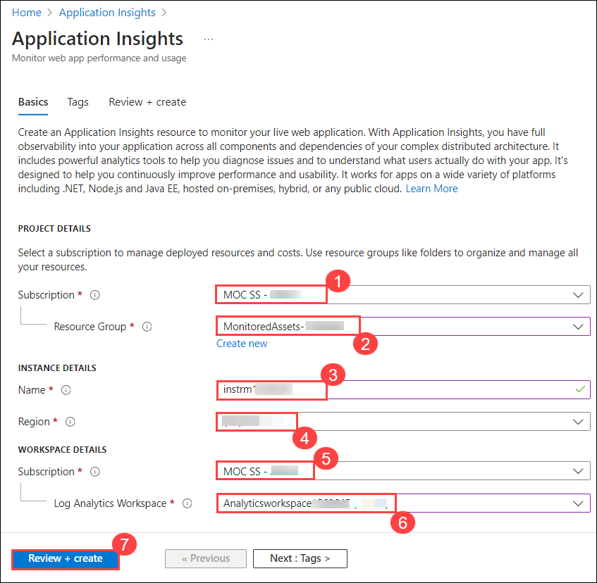
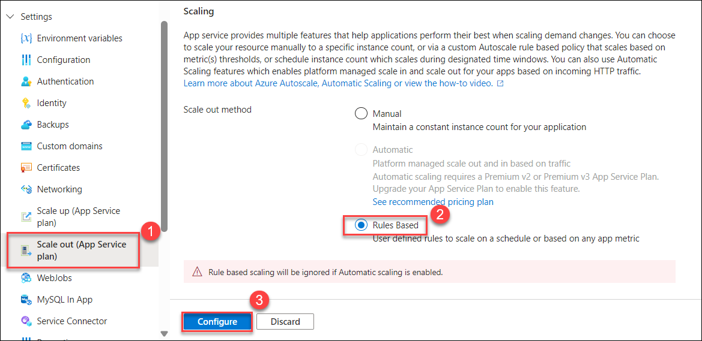
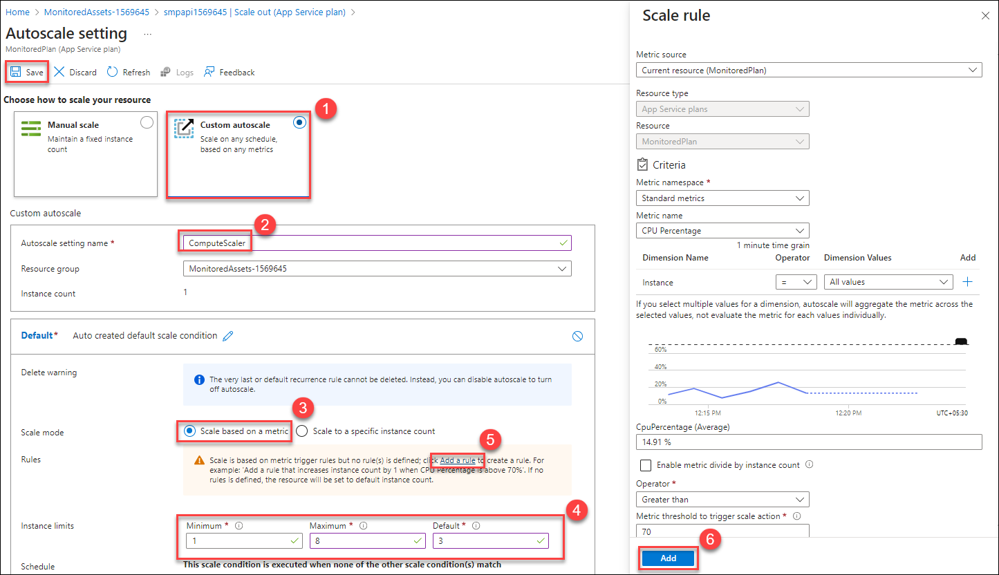
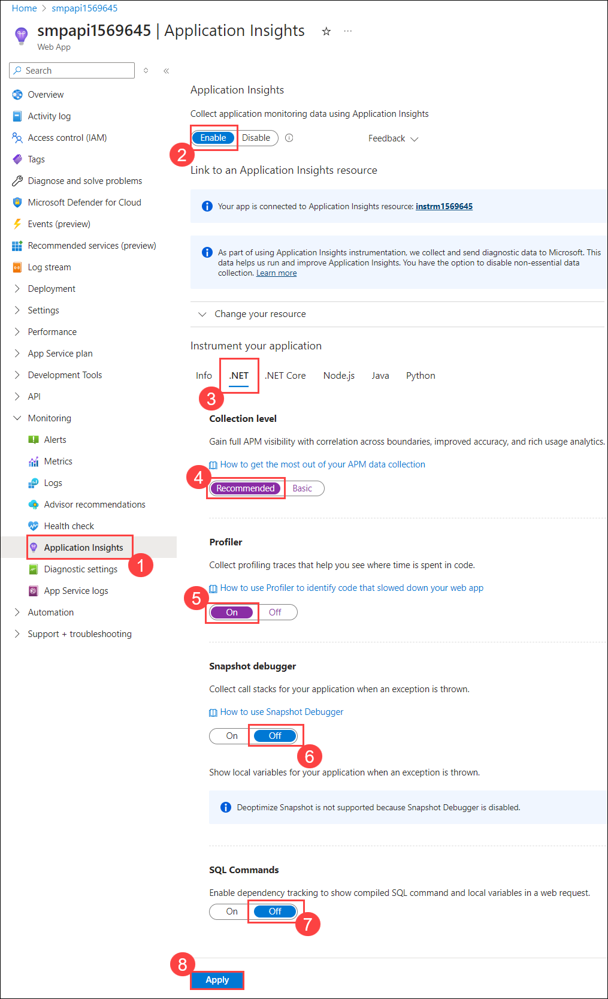

# Lab 11: Monitor services that are deployed to Azure

## Lab Scenario

In this lab, you will create an Application Insights resource in Azure that will be used to monitor and log application insight data for later review. The API will be set to automatically scale if demand increases to a certain threshold and logging the data will help determine how the service is being utilized.

## Lab objectives

In this lab, you will perform:

+ Exercise 1: Create and configure Azure resources
+ Exercise 2: Monitor a local web API by using Application Insights
+ Exercise 3: Monitor a web API using Application Insights
   
## Estimated timing: 60 minutes

## Architecture diagram


### Task 00: Lab setup and pre-requisites

Before starting this lab, you must complete **Prerequisites** of this lab.

To install the **C#** extension for this lab, follow the below steps in Visual Studio code:

1. Start Visual Studio Code.

     

2. Select the **Extensions (1)** blade from the left panel. Search with **C# (2)** and select **Install (3)** to install the extension.

    

4. After installing C# extensions, close the Visual Studio code.

## Exercise 1: Create and configure Azure resources

In this exercise, you create the Azure resources that you'll use for the remainder of the lab.

### Task 1: Open the Azure portal

1. If you are not logged in already, click on the **Azure portal** shortcut that is available on the desktop and log in with Azure credentials.

   * **Email/Username:** <inject key="AzureAdUserEmail"></inject>

     

1. Now enter the following **Password** and click on **Sign in**.

   * **Password:** <inject key="AzureAdUserPassword"></inject>

      .png)
    
1. If you see the pop-up **Stay Signed in?**, click **No**.

    

1. On the **Welcome to Microsoft Azure** page, click on **Cancel**.

    .png)

### Task 2: Create Log Analytics Workspace

1. In the Azure portal, use the **Search resources, services, and docs** text box at the top of the page to search for **Log Analytics workspaces** and then, in the list of results, select **Log Analytics workspaces**.

2. On the **Log Analytics workspaces** blade, select **+ Create**.

3. On the **Log Analytics workspaces** blade, on the **Basics** tab, perform the following actions, and select **Review + Create**:

      | Setting                         | Action                                                       |
      | ------------------------------- | ------------------------------------------------------------ |
      | **Subscription** drop-down list | Retain the **default value**                                    |
      | **Resource group** section      | Select **MonitoredAssets-<inject key="DeploymentID" enableCopy="false"/>** |
      | **Name** text box               | **Analyticsworkspace<inject key="DeploymentID" enableCopy="false"/>**    |
      | **Region** drop-down list       | Select the Azure **region in which your Resource group deployed** |

4. On the **Review + create** tab, **review** the options that you selected during the previous steps.

5. Select **Create** to create the **Log Analytics Workspace** by using your specified configuration.

    > **Note**: **Wait for the creation task to complete** before you proceed with the next task.

### Task 3: Create an Application Insights resource

1. In the Azure portal, use the **Search resources, services, and docs** text box at the top of the page to search for **Application Insights** and then, in the list of results, select **Application Insights**.

1. On the **Application Insights** blade, select **+ Create**.

1. On the **Application Insights** blade, on the **Basics** tab, perform the following actions, and select **Review + Create (7)**:
    
    | Setting                         | Action                                                       |
    | ------------------------------- | ------------------------------------------------------------ |
    | **Subscription** drop-down list | Retain the **default value (1)**                                    |
    | **Resource group** section      | Select Existing **MonitoredAssets-<inject key="DeploymentID" enableCopy="false"/> (2)** |
    | **Name** text box     | **instrm<inject key="DeploymentID" enableCopy="false"/> (3)** |
    | **Region** drop-down list       | Select the Azure **region in which your Resource group deployed (4)** |
    | **WORKSPACE DETAILS** section | Retain the default values for the **Subscription (5)** and **Log Analytics Workspace (6)** drop-down lists|
    
    The following screenshot displays the configured settings on the **Application Insights** blade.

    
     
1. On the **Review + Create** tab, **review** the options that you selected during the previous steps.

1. Select **Create** to create the **Application Insights** instance by using your specified configuration.

    > **Note**: **Wait for the creation task to complete** before you proceed with this lab.

1. On the **Microsoft.AppInsights \| Overview** blade, select the **Go to resource** button to navigate to the blade of the newly created **Application Insights** resource.

1. On the **Application Insights** blade, in the **Configure** section, select the **Properties** link.

1. On the **Properties** blade, next to the **Instrumentation Key** entry, select the **Copy to clipboard** button, and then **record** the copied value. You'll use it later in this lab.

    > **Note**: The key is used by client applications to connect to a specific **Application Insights** resource.

### Task 4: Create an Azure Web API resource

1. In the Azure portal, use the **Search resources, services, and docs** text box at the top of the page to search for **App Services** and then, in the list of results, select **App Services**.

1. On the **App Services** blade, select **+ Create** and then select **+ Web App**. 
    
1. On the **Create Web App** blade, on the **Basics** tab, perform the following actions, and then select the **Monitor + secure** tab:

    | Setting                         | Action                                                       |
    | ------------------------------- | ------------------------------------------------------------ |
    | **Subscription** drop-down list | Retain the **default value**.                                   |
    | **Resource group** drop-down list      |Select **MonitoredAssets-<inject key="DeploymentID" enableCopy="false"/>** |
    | **Name** text box     | Enter **smpapi<inject key="DeploymentID" enableCopy="false"/>**                           |
    | **Publish** section       | Select **Code** |
    | **Runtime stack** drop-down list | Select **.NET 8 (LTS)**|
    | **Operating System** section |  Select **Windows**|
    | **Region** drop-down list |  Select the Azure **region in which your Resource group deployed** |
    | **Windows Plan** section |  Select **Create new** |
    | **Name** text box |  Enter **MonitoredPlan**, and then select **OK** |
    |  **Pricing Plan** section |  Retain the **default value** |
    
1. On the **Monitoring** tab, perform the following actions, and then select **Review + Create**:
    
    | Setting                         | Action                                                       |
    | ------------------------------- | ------------------------------------------------------------ |
    | **Enable Application Insights** section | Ensure that **Yes** is selected                                    |
    | **Application Insights** drop-down list     | Select the **instrm<inject key="DeploymentID" enableCopy="false"/>** Application Insights resource that you created previously in this lab.|
    
1. On the **Review + Create** tab, **review** the options that you selected during the previous steps.

1. Select **Create** to create the web API by using your specified configuration.

   > **Note**: **Wait for the creation task to complete** before you proceed with this lab.

1. On the deployment **Overview** blade, select the **Go to resource** button to navigate to the blade of the newly created Azure web API.

1. On the **App Service** blade, in the **Settings** section, select the **Configuration** link.

1. In the **Environment Variables** section, perform the following actions:
    
    a. On the **App settings** tab, select **Show values** to display secrets associated with your web API.

    b. Click on **APPLICATIONINSIGHTS_CONNECTION_STRING** and note the value. This value was set automatically when you built the web API resource.

1. On the **App Service** blade, select **Overview** at the top of the service menu.

1. On the **App Service** blade, in the **Essentials** section, **record** the value of the **Default domain** link. You'll use this value later in the lab to submit requests to the web API.

### Task 5: Configure web API autoscale options

1. On the **App Service** blade, in the **Settings** section, select the **Scale out (App Service Plan) (1)** link.

1. Scroll down until you see the **Scale out method**. Click on the **Rules Based (2)** option.

1. Select **Configure (3)**.

    

1. In the **AutoScale setting** section, perform the following actions, and then select **Save**:
    
    | Setting                         | Action                                                       |
    | ------------------------------- | ------------------------------------------------------------ |
    | **Scale out** section | Select **Custom autoscale (1)**|
    | **Autoscale setting name** text box     | Enter **ComputeScaler (2)**|
    | **Resource group** drop-down list     |Select **MonitoredAssets-<inject key="DeploymentID" enableCopy="false"/>** |
    | **Scale mode** section      | Select **Scale based on a metric (3)** |
    | **Minimum ** text box in the **Instance limits** section | Enter **1 (4)** |
    | **Maximum** text box in the **Instance limits** section | Enter **8 (4)** |
    | **Default** text box in the **Instance limits** section | Enter **3 (4)** |
    | **Rules** section |  Select **Add a rule (5)** |
    | **Scale rule** blade | Retain default values for all settings, and then select **Add (6)** |

    The following screenshot displays additional settings in the **Scale out** section on the **App Service** blade.

       

    > **Note**: **Wait for the save operation to complete** before you continue with this lab.

    > **Congratulations** on completing the task! Now, it's time to validate it. Here are the steps:
   - Hit the Validate button for the corresponding task.
   - If you receive a success message, you can proceed to the next task.
   - If not, carefully read the error message and retry the step, following the instructions in the lab guide.
   - If you need any assistance, please contact us at labs-support@spektrasystems.com. We are available 24/7 to help you out.
 
   <validation step="f5ad11dd-989f-4603-b5d7-f06fe3980f77" />

In this exercise, you created the Azure resources that you'll use for the remainder of the lab.

## Exercise 2: Monitor a local web API by using Application Insights

In this exercise, you create an API app by using ASP.NET and configure it to stream application metrics to Application Insights. You then use the Application Insights dashboard to review the performance details of your API.

### Task 1: Build a .NET Web API project

1. From the lab computer, start **Visual Studio Code**.

1. In Visual Studio Code, on the **File** menu, select **Open Folder**.

1. In the **Open Folder** window, browse to **C:\AllFiles\AZ-204-DevelopingSolutionsforMicrosoftAzure-master\Allfiles\Labs\11\Starter**, and then select **Api** Folder.

1. On the **Visual Studio Code** pop-up select **Yes, I trust the authors**.

1. In the **Visual Studio Code** window, on the Menu Bar, select **Terminal** and then select **New Terminal**.

1. At the terminal prompt, **run** the following command to **create** a new .NET Web API application named **SimpleApi** in the current directory:

    ```
    dotnet new webapi --output . --name SimpleApi --framework net8.0
    ```

1. If any **error** occurs regarding the framework try installing .net 8.0 again using the below commands

    ```
    Invoke-WebRequest 'https://dot.net/v1/dotnet-install.ps1' -OutFile 'dotnet-install.ps1';
   ./dotnet-install.ps1 -InstallDir '~/.dotnet' -Version '6.0.4' -Runtime 'dotnet' -ProxyAddress $env:HTTP_PROXY -ProxyUseDefaultCredentials;
    ```

1. **Run** the following command to import version 2.20.0 of **Microsoft.ApplicationInsights** from NuGet to the current project:

    ```
    dotnet add package Microsoft.ApplicationInsights --version 2.21.0
    ```

    > **Note**: The **dotnet add package** command will add the **Microsoft.ApplicationInsights** package from NuGet. For more information, refer to [Microsoft.ApplicationInsights](https://www.nuget.org/packages/Microsoft.ApplicationInsights/).

1. Run the following command to import **version 2.21.0** of **Microsoft.ApplicationInsights.AspNetCore** from NuGet:

    ```
    dotnet add package Microsoft.ApplicationInsights.AspNetCore --version 2.21.0
    ```

    > **Note**: The **dotnet add package** command will add the **Microsoft.ApplicationInsights.AspNetCore** package from NuGet. For more information, refer to [Microsoft.ApplicationInsights.AspNetCore](https://www.nuget.org/packages/Microsoft.ApplicationInsights.AspNetCore).

1. At the **terminal prompt**, **run** the following command to import **version 2.20.0** of **Microsoft.ApplicationInsights.PerfCounterCollector** from NuGet to the current project:

    ```
    dotnet add package Microsoft.ApplicationInsights.PerfCounterCollector --version 2.21.0
    ```

    > **Note**: The **dotnet add package** command will add the **Microsoft.ApplicationInsights.PerfCounterCollector** package from NuGet. For more information, refer to [Microsoft.ApplicationInsights.PerfCounterCollector](https://www.nuget.org/packages/Microsoft.ApplicationInsights.PerfCounterCollector/).

1. At the **terminal prompt**, **run** the following command to import **version 2.4.0** of **Microsoft.ApplicationInsights.Profiler.AspNetCore** from NuGet to the current project:

    ```
    dotnet add package Microsoft.ApplicationInsights.Profiler.AspNetCore --version 2.4.0
    ```

    > **Note**: The **dotnet add package** command will add the **Microsoft.ApplicationInsights.Profiler.AspNetCore** package from NuGet. For more information, refer to [Microsoft.ApplicationInsights.Profiler.AspNetCore](https://www.nuget.org/packages/Microsoft.ApplicationInsights.Profiler.AspNetCore/).

1. At the **terminal prompt**, **run** the following command to build the .NET Web API:

    ```
    dotnet build
    ```

    > **Congratulations** on completing the task! Now, it's time to validate it. Here are the steps:
   - Hit the Validate button for the corresponding task.
   - If you receive a success message, you can proceed to the next task.
   - If not, carefully read the error message and retry the step, following the instructions in the lab guide.
   - If you need any assistance, please contact us at labs-support@spektrasystems.com. We are available 24/7 to help you out.
 
   <validation step="6154bcdd-d256-4ed6-8eb2-aaffcd393c2b" />

### Task 2: Update app code to disable HTTPS and use Application Insights

1. In the **Visual Studio Code** window, on the **Explorer** pane, select the **Program.cs** file to open the file on the **editor** pane.

1. On the **editor** pane, locate and delete the following code in line 17:

    ```csharp
    app.UseHttpsRedirection();
    ```

    > **Note**: This line of code forces the web API to use HTTPS. For this lab, this is unnecessary.

1. In the **Program.cs** file, **add** the following two lines starting with **line 7** to enable Profiler by registering it along with Application Insights into the Service collection:

    ```csharp
    builder.Services.AddApplicationInsightsTelemetry();
    builder.Services.AddServiceProfiler();
    ```

1. **Save the changes** and close the **Program.cs** file.

1. In the **Visual Studio Code** window, on the **Explorer** pane, select the **appsettings.json** file to open the file on the **editor** pane.

1. Select the **appsettings.json** file to open the file on the **editor** pane, **delete the code and replace** it with the below code and update replacing the `instrumentation-key` placeholder with the value of the Application Insights resource instrumentation key that you recorded earlier in this lab:

    ```json
       {
         "Logging": {
           "LogLevel": {
             "Default": "Information",
             "Microsoft.AspNetCore": "Warning"
           }
         },
         "ApplicationInsights":
         {
            "InstrumentationKey": "instrumentation-key"
         },
         "AllowedHosts": "*"
      }
    ```

    > **Note**: If the section you are adding is the last element of the file, remove the trailing comma.

1. **Save the changes** to the **appsettings.json** file and close it.

1. At the **terminal prompt**, **run** the following command to build the .NET Web API.

    ```
    dotnet publish -c Release -r win-x86 --self-contained -p:PublishReadyToRun=true .\SimpleApi.csproj
    ```

### Task 3: Test an API application locally

1. At the **terminal prompt**, **run** the following command, and then select **Enter** to create a certificate. Select **YES** on the prompted option.

    ```
    dotnet dev-certs https --trust
    ```

1. At the **terminal prompt**, **run** the following command to launch the .NET Web API.

    ```
    dotnet run
    ```
    > **Note**: Sometimes you will be getting two port numbers, Record any of the **Port numbers** mentioned in your Output display of Visual Studio code. for example, As shown in the below image.
    
    

    > **Note**: Make Sure the **Service Profiler session is in a running state**, **if it is stopped Rerun the command**

    ```
    dotnet run
    ```
    
1. **Review the output** of the command and note the HTTPS URL that the site is listening on.

1. From the taskbar, **open** the context menu for the **Microsoft Edge** icon, and then **open** a new browser window.

1. In the browser window that opens, navigate to the `http://localhost` URL and add the **/weatherforecast** relative path of your web API.
    
    > **Note**: The full URL is `http://localhost:[port-number]/weatherforecast`, where the `[port-number]` placeholder identifies the port number copied in the previous step to which the web app is accessible via the HTTPS protocol.

    > **Note**: The page should contain an output in the following format:

    ```json
    [
        {
            "date": "2023-10-29",
            "temperatureC": -8,
            "summary": "Sweltering",
            "temperatureF": 18
        },
        {
            "date": "2023-10-30",
            "temperatureC": -12,
            "summary": "Hot",
            "temperatureF": 11
        },
        {
            "date": "2023-10-31",
            "temperatureC": 50,
            "summary": "Chilly",
            "temperatureF": 121
        },
        {
            "date": "2023-11-01",
            "temperatureC": 51,
            "summary": "Chilly",
            "temperatureF": 123
        },
        {
            "date": "2023-11-02",
            "temperatureC": 29,
            "summary": "Balmy",
            "temperatureF": 84
        }
    ]
    ```

1. **Close** the browser window that's displaying the page generated by `http://localhost:[port-number]/weatherforecast`.

1. In Visual Studio Code, select **Kill Terminal** (the **Recycle Bin** icon) to close the **terminal** pane and any associated processes.

### Task 4: Review metrics in Application Insights

1. On your lab computer, switch to the **Microsoft Edge** browser window displaying the Azure portal.

1. In the **Azure portal**, navigate back to the blade of the **instrm<inject key="DeploymentID" enableCopy="false"/>** Application Insights resource you created previously in this lab.

1. On the **Application Insights** blade, in the tiles in the center of the blade, find the displayed metrics. Specifically, find the number of server requests that have occurred and the average server response time.

    The following screenshot displays the **Application Insights** metrics of the local web app.

     

    > **Note**: **It can take up to five minutes** to observe requests in the Application Insights metrics charts.

### Review

In this exercise, you created an API app by using ASP.NET and configured it to stream application metrics to Application Insights. You then used the Application Insights dashboard to review the performance details of your API.

## Exercise 3: Monitor a web API using Application Insights

### Task 1: Deploy an application to the web API

1. **Open** a new tab in your Microsoft browser and paste the following link into the address bar: **https://aka.ms/installazurecliwindows**. Once the file is downloaded, click on it to initiate the installation of Azure CLI.

1. On the lab computer, **switch** to the Visual Studio Code.

1. In the **Visual Studio Code** window, on the Menu Bar, select **Terminal** and then select **New Terminal**.

1. At the **terminal prompt**, **run** the following command to ensure that the current directory is set to the **Allfiles (C):\AllFiles\AZ-204-DevelopingSolutionsforMicrosoftAzure-master\Allfiles\Labs\11\Starter\Api\bin\Release\net8.0\win-x86\publish**, where the deployment files reside:

    ```
    cd C:\AllFiles\AZ-204-DevelopingSolutionsforMicrosoftAzure-master\Allfiles\Labs\11\Starter\Api\bin\Release\net8.0\win-x86\publish
    ```

1. **Run** the following command to create a zip file containing the starter project that you'll deploy next to the Azure web API:

    ```PowerShell
    Compress-Archive -Path * -DestinationPath api.zip
    ```

1. At the **terminal prompt**, **run** the following command to sign in to your Azure subscription by using Azure PowerShell ISE:

    ```PowerShell
    Connect-AzAccount
    ```

    > **Note**: If prompted, click on **Work or School account** and enter the **Azure credentials** provided in the environment to authenticate.

1. **Close** the newly opened browser tab and switch back to the terminal prompt in the Visual Studio Code window.

1. **Run** the following command to display the listing of all web apps in the **MonitoredAssets-<inject key="DeploymentID" enableCopy="false"/>** resource group:

    ```PowerShell
    Get-AzWebApp -ResourceGroupName MonitoredAssets-{DeploymentID}
    ```
    > **Note**: **Replace** DeploymentID with **<inject key="DeploymentID" enableCopy="false"/>**
    
1. **Run** the following command to display the list of web apps in the **MonitoredAssets-<inject key="DeploymentID" enableCopy="false"/>** resource group, which names start with **smpapi\***:

    ```PowerShell
    Get-AzWebApp -ResourceGroupName MonitoredAssets-{DeploymentID} | Where-Object {$_.Name -like 'smpapi*'}
    ```
    > **Note**: Replace DeploymentID with **<inject key="DeploymentID" enableCopy="false"/>**
    
1. **Run** the following commands to display the name of the first of the web apps identified in the previous step and store it in a variable named **$webAppName**:

    ```PowerShell
    Get-AzWebApp -ResourceGroupName MonitoredAssets-{DeploymentID} | Where-Object {$_.Name -like 'smpapi*'} | Select-Object -ExpandProperty Name
    ```
    
    ```PowerShell
    $webAppName = (Get-AzWebApp -ResourceGroupName MonitoredAssets-{DeploymentID} | Where-Object {$_.Name -like 'smpapi*'})[0] | Select-Object -ExpandProperty Name
    ```
    > **Note**: **Replace** DeploymentID with **<inject key="DeploymentID" enableCopy="false"/>**
    
1. **Run** the following command to deploy the **api.zip** file you created previously in this task to the web API whose name you identified in the previous step:

    ```PowerShell
    Publish-AzWebApp -ResourceGroupName MonitoredAssets-{DeploymentID} -Name $webAppName -ArchivePath "C:\AllFiles\AZ-204-DevelopingSolutionsforMicrosoftAzure-master\Allfiles\Labs\11\Starter\Api\bin\Release\net8.0\win-x86\publish\api.zip" -force
    ```

    > **Note**: Replace DeploymentID with **<inject key="DeploymentID" enableCopy="false"/>**   
    
    > **Note**: If prompted to authenticate, run `az login` and follow instructions to complete the sign-in process and **re-run** the above command.

    > **Note**: **Wait for the deployment to complete** before you continue with this lab.

1. On the lab computer, **launch** another Microsoft Edge browser window.

1. In the browser window, navigate to the *Azure Web API app** into which you deployed the API app previously in this task by appending to its URL (that you recorded previously in this lab) the suffix **/weatherforecast**.

    > **Note**: For example, if your URL is `https://smpapianu.azurewebsites.net`, the new URL would be `https://smpapianu.azurewebsites.net/weatherforecast`.

1. **Verify** that the output resembles the one generated when running the API app locally.

    > **Note**: The output will include different values but it should have the same format.

### Task 2: Configure in-depth metric collection for Web Apps

1. On your lab computer, switch to the **Microsoft Edge** browser window displaying the Azure portal.

1. In the Azure portal, navigate back to the blade of the **smpapi<inject key="DeploymentID" enableCopy="false"/>** web app resource you created previously in this lab.

1. On the **App Service** blade, select **Application Insights (1)** under **Monitoring**.

1. On the **Application Insights** blade, perform the following actions, select **Apply (8)**, and then in the confirmation dialog, select **Yes**:

    | Setting                         | Action                                                       |
    | ------------------------------- | -------------------------------|
    | **Application Insights** slider | Ensure it is set to **Enable (2)** |
    | **Instrument your application** section    | Select the **.NET (3)** tab |
    | **Collection level** section    | Select **Recommended (4)**  |
    | **Profiler** section      | Select **On (5)** |
    | **Snapshot debugger** section | Select **Off (6)** |
    | **SQL Commands** section | Select **Off (7)** |
    
    The following screenshot displays the **Application Insights** settings of the Azure Web API.
     
     
      
1. **Switch** to the browser tab you opened in the previous task to display the results of the deployment of your API app to the target Azure API app (including the **/weatherforecast** relative path in the target URL) and refresh the browser page several times.

1. **Review** the JSON-formatted output generated by the API.

1. **Record** the URL that you used to access the JSON-formatted output.

    > **Note**: The URL should be in the format `https://smpapianu.azurewebsites.net/weatherforecast`.

### Task 3: Get updated metrics in Application Insights

1. **Return** to the browser window displaying the Azure web app in the Azure portal.

1. On the **Application Insights** blade of the web app, select the **View Application Insights data** link.

1. On the **Application Insights** blade, **review** the collected metrics in the tiles in the center of the blade, including the number of server requests that have occurred and the average server response time.
 
    The following screenshot displays the **Application Insights** metrics of the Azure web app in the Azure portal.
     
     

    > **Note**: It can take up to **five minutes** for updated metrics to appear in the Application Insights metrics charts.
    
    > **Congratulations** on completing the task! Now, it's time to validate it. Here are the steps:
   - Hit the Validate button for the corresponding task.
   - If you receive a success message, you can proceed to the next task.
   - If not, carefully read the error message and retry the step, following the instructions in the lab guide.
   - If you need any assistance, please contact us at labs-support@spektrasystems.com. We are available 24/7 to help you out.
 
   <validation step="cd33d7df-0eab-4f1c-8da1-19c9f04ba5c8" />
    
### Task 4: View real-time metrics in Application Insights

1. In the Azure portal, navigate back to the blade of the **instrm<inject key="DeploymentID" enableCopy="false"/>** Application Insights resource you created previously in this lab.

1. On the **Application Insights** blade, in the **Investigate** section, select **Live metrics**.

1. **Switch back** to the browser window displaying the target API app running in the target Azure web app (which targets the **/weatherforecast** relative path in the target URL), and then refresh the browser page several times.

1. **Switch** to the browser window displaying the **Live metrics** blade and review its content.

    > **Note**: The **Incoming Requests** section should update within seconds, showing the requests that you made to the web API.

### Review

In this exercise, you configured and tested Application Insights logging of your web API app.

## You have successfully completed the lab
