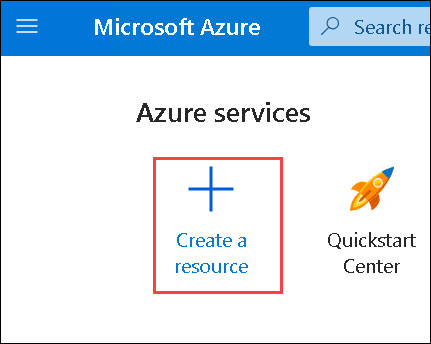

# Lab 13: Create and configure an Azure web app

## Lab Scenario

In this lab, you will deploy and configure an Azure Web App that integrates with GitHub. The web app will be a simple implementation of a single-page web app accessible only to internal employees. The website will host content related to company strategies and division sales goals.

To create the web app, you will use the Azure portal and connect it to a GitHub repository. To do this, you will need a free GitHub account, where you will upload the sample website content provided as part of this lab. Once the web app is up and running, you will make changes to the content and watch as the GitHub content is synced to the web app, using the CI/CD methodology.

Because this is an employee-only web app, you will need to secure access to the web app by creating users in Azure AD and implementing security for the web app through user authentication.

## Lab objectives

In this lab, you will perform:

+ Exercise 1: Create an Azure App Service Web App
+ Exercise 2: Enable autoscale for the web app
+ Exercise 3: Configure user authentication and authorization
+ Exercise 4: Application Insights for Web App
+ Exercise 5: Enable caching for the web app

## Estimated timing: 120 minutes

## Architecture diagram


## Lab setup and pre-requisites

Before starting this lab, you must complete **Prerequisites** of this lab.

- You need to have a GitHub Account.

### Exercise 1: Create an Azure App Service Web App

#### Task 1: Create a GitHub account and upload the sample web app code to a repository

1. On the taskbar, select the **Microsoft Edge** icon.

1. In the browser window, browse to the GitHub website at `https://github.com/`. Click on **Sign in**.

    

1. On the Sign in to GitHub page, provide your personal GitHub username **(1)** and Password **(2)** and then click on **Sign in (3)**.

    

1. Navigate to your mail, you will be getting an verfication code. Paste the verfication code **(1)** and then click on **Verify (2)**.

    

1. Once you've logged in, create a new repository by clicking the **New** button on the main page.

    

1. Give your repository a name as **webapp (1)** and description, and choose **public (1)**. Enable the checkbox for **Add a README file (3)** and then click on **Create repository (4)**.

    

1. Select on **Create repository** to create the repository.

1. In the repository page on GitHub, select the **Add file (1)**, from drop-down list select **Upload Files (2)**.

    

1. Click on **choose your files**.

    

1. Open the **File Explorer** window, navigate to `C:\AllFiles\AZ-204-DevelopingSolutionsforMicrosoftAzure-master\Allfiles\Labs\13\Starter\webapp-sam-lab13`, press **Enter**. select all files and folders. Then use the **drag and drop** feature, to add them to GitHub repository.

    

1. Add a commit message that describes the changes you made (e.g. "Initial commit of sample web app code") **(1)** and select **Commit changes (2)** to upload the sample web app code to the repository.

    

#### Task 2: Create the web app in the Azure portal and connect it to the GitHub account

1. On the taskbar, select the **Microsoft Edge** icon.

1. In the browser window, browse to the Azure portal at `https://portal.azure.com`, and then sign in with the account you'll be using for this lab.

1. In the Azure portal's navigation pane, select the **Create a resource** button in the left-hand menu.

    

1. In the search bar, type **Web App (1)** and select **Web App (2)** from the list of options.

    

1. In the **Web App** blade, select **Create**.

1. In the **Create Web App** blade, select the **Basics** tab and perform the following actions.

    | Setting | Action |
    | -- | -- |
    | **Subscription** drop-down list | Retain the default value **(1)**|
    | **Resource group** | Select **ConfidentialStack-<inject key="DeploymentID" enableCopy="false"/> (2)** |
    | **Name**  | Enter **webapp-<inject key="DeploymentID" enableCopy="false"/> (3)** |
    | **Publish**  | Select **Code (4)** |
    | **Runtime stack**  | Select **.NET 8 (LTS) (5)** |
    | **Operating System**  | Select **Windows (6)** |
    | **Region**  | Select **<inject key="Region" enableCopy="false"/> (7)** |
    | **Windows Plan (East US)** | Select **Create new** and enter **ManagedPlan** in the **Name** field, and then select **OK** **(8)** |
    | **Pricing plan** | Select **Standard S1 (9)** |
    - Naviagte to **Monotor+secure (10)** from the top bar.

        

              

1. Select the **Monitoring** tab and select **Yes (1)** in the **Enable Application Insights** section. Then select **Review + create (2)**.

    

1. Review the options that you selected during the previous steps and then select **Create**.

   > **Note**: Wait for the web app to be created before you continue with this lab.

1. On the **Overview** blade, select the **Go to resource** button to navigate to the newly created web app.

    

#### Task 3: Deploy Web App from GitHub 

<!-- Is step 1 needed since they should already be there if they selected "Go to resource" above? -->

1. Open the Azure portal and navigate to the web app that you created in previous task.

1. In the **Settings (1)** section, select **Configuration (2)** from the left-hand menu. On the **Configuration** blade, select **General settings**. In the **General settings** tab, select **On (3)** for **Basic Auth Publishing Credentials**, select **Save (4)**. 

    

1. Then select **Continue**.    

    

     > **Note**: Wait for a minute to save the configurations.

1. In the **Deployment (1)** section, select **Deployment Center (2)** from the left-hand menu. In the **Settings (3)** tab, select **Source** from drop-down list select **GitHub (4)**.

    

1. Scroll down on the **GitHub** section and select the **Authorize** button to allow Azure to access your GitHub account.

    

        

1. After successfully authorizing the GitHub access perform the following actions: , and then select **Save (4)**:
   
    | Setting | Action |
    | -- | -- |
    | **Organization** drop-down list | select your GitHub organization **(1)**|
    | **Repository** drop-down list | select repository that you created in Task 1 **(2)**|
    | **Branch** drop-down list | select main branch **(3)** |

     

      > **Note**: Wait for a minute to save the configurations.

1. Open the GitHub repository that you created in previous task, select the **Actions (1)** from the top menu. On the **Actions** tab, under the **All workflows**, select the **Add or update the Azure App Service build and deployment workflow config (2)** to see build and deployment process.

    

     

1. After successfully building and deploying, open the Azure portal and navigate to the **App Service**.

1. On the **App Service** blade, select **Overview** and then select **Browse**.

    

1. Review and test the web app's various functions and features to ensure that they work as intended.

    

   > **Note**: Keep the web app browser window open, you will need it later. 

#### Task 4: Make changes to the code in GitHub and verify that the changes are reflected in the web app

1. Open the GitHub repository that contains the code for the web app.

1. Select the **Pages** folder.

    

1. Select **Index.cshtml** file, in the code preview.

    

1. Select **Pencil Icon (1)** for Editing the file. On the code editor tab for the **Index.cshtml** file, delete line **9** code in the existing file.**(2)**

    ```html
    <h1>My Gallery</h1>
    ```

     
    
1. Add the following code: **(1)**

    ```html
    <h1>Portfolio Gallery</h1>
    <P>This is a simple .NET web project.</P>
    ```

1. Select **Commit Changes (2)**, write a **Commit message** and **Extended description**, then select **Commit Changes** for the **Index.cshtml** file.

    

     > **Note**: Wait for the changes to be reflected in the web app. This may take a few minutes to an hour, depending on the deployment process.
 
1. Open the web app browser window, and refresh the browser window to see the changes.

1. Verify that the changes are visible.

    

1. Test the functionality affected by the changes to ensure that everything is working as expected.

1. If the changes are not reflected in the web app, check the deployment logs and troubleshoot as needed.

1. If the changes are still not visible, contact your trainer for assistance.  

   > **Note**: Remember to always test changes before committing them to the repository and deploying them to the web app. Additionally, it's important to follow best practices for version control and collaboration when working with code in GitHub.

This exercise is about creating a web app in the Azure portal and connecting it to a GitHub repository.

### Exercise 2: Enable autoscale for the web app

#### Task 1: Enable custom scaling

1. Open the Azure portal and navigate to the **App Service**, select the web app you created in the previous exercise.

1. On the **Web App** blade, select **Scale out (App Service plan) (2)** from the **Settings (1)** section.

    

1. On the **Scale out (App Service plan)** page, select **Rules Based (1)** under **Scale out method** and then click on **Configure (2)**

    

1. On the **Autoscale setting** page, Select **Custom autoscale**.

    

1. Enter the following information, and then select **Save (7)**:
    
    | Setting | Information |
    | -- | -- |
    | **Scale mode**  | Select **Scale based on a metric (1)** |
    | **Rules**  | Select **Add a rule (2)** link, on the **Scale rule** blade, retain default values for all settings, and then select **Add (3)** |
    | **Minimum** text box in the **Instance limits** section | Enter **1 (4)** |
    | **Maximum** text box in the **Instance limits** section | Enter **4 (5)** |
    | **Default** text box in the **Instance limits** section | Enter **2 (6)** | 

         

          

     > **Note**: Wait for the save operation to complete before you continue with this lab.

#### Task 2: Configure scale-out options based on CPU usage to increase the instance count

1. On the **Autoscale setting** page, scroll down and select **+ Add a rule**.

    

1. On the **Scale rule** page, perform the following actions and then select **Add** and then select **Save**:
    
    | Setting | Action |
    | -- | -- |
    | **Metric name** drop-down list | Select **CPU Percentage** |
    | **Operator** drop-down list | Select **Greater than** |
    | **Metric threshold to trigger scale action** text box | Enter **60** |
    | **Duration (minutes)** text box | Enter **5** |
    | **Operation** drop-down list | Select **Increase count by** | 
    | **Cool down (minutes)** text box | Enter **5** | 
    | **instance count** text box | Enter **1** | 

1. Test the rule by generating traffic that reaches the CPU threshold you set.

1.  Verify that the auto scaling group scales out as expected.

    > **Note**: Similar steps can be followed to configure scale-in options based on CPU usage to decrease the instance count


#### Task 3: Configure scale-in options based on CPU usage to decrease the instance count

1. On the **Autoscale setting** page, scroll down and select on **+ Add a rule**.

1. On the **Scale rule** page, perform the following actions, select **Add** and then select **Save**:
    
    | Setting | Action |
    | -- | -- |
    | **Metric name** drop-down list | Select **CPU Percentage** |
    | **Operator** drop-down list | Select **Less than** |
    | **Metric threshold to trigger scale action** text box | Enter **40** |
    | **Duration (minutes)** text box | Enter **5** |
    | **Operation** drop-down list | Select **Decrease count by** | 
    | **Cool down (minutes)** text box | Enter **3** | 
    | **instance count** text box | Enter **1** | 

1. Test the rule by generating traffic that reaches the CPU threshold you set.

1. Verify that the auto scaling group scales in as expected.

   > **Note**: Similar steps can be followed to configure scale-out options based on other metrics, such as memory usage or HTTP queue length.

#### Task 4: Create an Azure Load Testing

1. In the Azure portal, use the **Search resources, services, and docs** text box to search for **Azure Load Testing (1)** and then in the list of results, select **Azure Load Testing (2)**.

    

1. On the **Azure Load Testing** blade, select **+ Create**.

1. On the **Create a load testing resource** blade, perform the following actions, and then select **Review + Create (5)**:

    | Setting | Action |
    | -- | -- |
    | **Subscription** list | Leave the  default **(1)** |
    | **Resource group** drop-down list | Select **ConfidentialStack-<inject key="DeploymentID" enableCopy="false"/>** in the list |
    | **Name** text box | Enter **loadtest-<inject key="DeploymentID" enableCopy="false"/> (3)** |
    | **Region** drop-down list | **East US (4)** |

         

1. Select **Create** to create the Azure load testing. 

   > **Note**: Wait for the Azure load testing to be created before you continue with this lab.

1. On the **Overview** blade, select the **Go to resource** button to navigate to the blade of the newly created Azure load testing.    

#### Task 5: Quick test and analyze the performance metrics of web app

1. On the new created **Azure Load Testing** blade, in the **Tests** section, select the **Tests (1)**. Select **+ Create (2)**, from drop-down list, select **Create a URL-based test (3)**.

    

1. On the **Create a URL-based test** blade, perform the following actions, and then select **Review+create (7)**:

    | Setting | Action |
    | -- | -- |
    | **Enable advanced settigs** | Uncheck the box **(1)** |
    | **Test URL** text box | Enter *your web app URL that you created in this lab* **(2)** |
    | **Specify load** section | Select **Virtual users (3)** in the list |
    | **Number of virtual users** text box | Enter **100 (4)** |
    | **Test duration (minutes)** text box | Enter **3 (5)** |
    | **Ramp-up time (minutes)** text box | Enter **0 (6)** |

     

     >**Note:** To get thde webapp URL, naviagte to your webapp. Right click on the **Default domain** and then click on **Copy link**.

           

     > **Note**: Wait about 3 minutes to finish the Azure load testing.

1. Once the load test is complete, analyze the performance metrics and identify any performance bottlenecks.

1. Select the **Load test results**, review the **Statistics** and **Client-side metrics** of your web app.

    

1. Select the **Engine health**, review the **Load engine health metrics** of your web app.

    

1. To download the load testing results, select the **Download**, from drop-down list, select the **Results**.

In this task, you created an Azure Load Testing web app and performed load testing on a target web application. You configured settings, monitored performance metrics, and analyzed results to identify performance bottlenecks.

In this exercise, you learned how to enable custom scaling for a web app by configuring rules based on CPU usage. You also performed load testing using Azure Load Testing and analyzed performance metrics to identify and address performance bottlenecks. This exercise provided hands-on experience in optimizing scalability and ensuring optimal performance for web applications.

### Exercise 3: Configure user authentication and authorization

#### Task 1: Configure authentication for the web app

1. Open the Azure portal and navigate to the web app that you want to configure for authentication.

1. On the **Settings** section, select **Authentication (1)** from the left-hand menu. On the **Authentication** pane, select **Add identity provider (2)**.

    

1. On the **Add an identity provider** page, perform the following actions, and then select **Add (9)**:

    | Setting | Action |
    | -- | -- |
    | **Identity provider** drop-down list | Select **Microsoft (1)** |
    | **Tenant type** section | Select **Workforce (2)** |
    | **App registration type** section | Select **Create new app registration (3)** |
    | **Name** text box | Enter **webapp-<inject key="DeploymentID" enableCopy="false"/>** **(4)**|
    | **Client secret expiration** | **Recommended 180 days** **(5)** |
    | **Supported account types** section | Select **Current tenant - Single tenant (6)** | 
    | **Restrict access** section | Select **Require authentication (7)** |
    | **Unauthenticated requests** section | Select **HTTP 302 Found redirect: recommended for websites (8)** |

     

             

1. Once you have configured your authentication provider, you can configure the specific authentication settings for your web application. This includes things like which users or groups are allowed to access your application, how users should be authenticated (e.g. via a sign-in page or a pop-up window), and what kind of access controls should be in place.

1. Open the web app browser window, and refresh the browser window. You should be prompted to log in via Microsoft authentication provider, and once you have done so you should be able to access your application as normal.

    

That's it! With these steps, you should be able to set up authentication for your Azure web application and ensure that only authorized users are able to access it.

#### Task 2: View activities in Sign-In Logs

1. Open the Azure portal and navigate to the **Microsoft Entra ID**.

    

1. On the **Microsoft Entra ID** page, select **Enterprise applications** from the left-hand menu.

    

1. On the **Enterprise applications | All applications** page, search and select your web app.

    

1. On the **Activity** section, select **Sign-in logs** from the left-hand menu.

1. You can filter the sign-in logs based on specific criteria, such as the user's name, the application they accessed, or the date and time of the sign-in.

    

1. You can also export the sign-in logs to a CSV file for further analysis or reporting.

   > **Note**: Wait for a few minutes to see recent sign-in logs.

That's it! With these steps, you should be able to configure Sign-In Logs for your Azure Web Service and ensure that your application is secure and compliant with your organization's policies.

This exercise is about configuring user authentication and sign-in logs for a web app.

### Exercise 4: Application Insights for Web App

#### Task 1: View the application’s performance through Application Insights

1. Open the Azure portal and navigate to the **App Service**, select the web app you created in the previous exercise.

1. On the **Web App** blade, select **Application Insights (1)** from the **Settings** section and slect **applicationinsights (2)** or you can also select **View Application Insights data**.

    

1. You should see a dashboard with several performance metrics for your application, including response times, server response times, and page views.

    

1. To view more detailed information about a specific metric, select it to open the corresponding chart.

1. From here, you can adjust the time range and granularity of the chart to view the data you're interested in.

1. You can also use the **Filter** option to narrow down the data based on specific criteria.

1. If you notice any performance issues, you can use the **Investigate** option to drill down into the data and identify the root cause of the issue.

1. Additionally, you can use the **Alerts** feature to set up alerts for specific performance metrics, so you can be notified if they fall outside of acceptable ranges.

    

In this task, you have now successfully viewed your application's performance through Application Insights! You can now move on to configuring custom telemetry in Task 3.

#### Task 2: Query the web performance metrics in Log Analytics

1. On the **Application Insights** blade, select **Logs** under the **Monitoring** section. Close the pop up's by clicking on **X**.

    

1. This will open the Log Analytics workspace for your Application Insights resource.

1. In the query editor, enter the following query to retrieve web performance metrics:

   ```bash  
   requests  
   | where timestamp > ago(24h)  
   | summarize count() by bin(timestamp, 1h), resultCode   
   ```

       

1. This query retrieves the number of requests and the HTTP status code for each hour over the last 24 hours. You can modify the time range and granularity of the query as needed.

1. Select **Run** to execute the query. The results will be displayed in a table below the query editor.

    

        

1. You can also visualize the query results by clicking on the **Chart** button in the query editor. This will open a chart that displays the data in a more visual format.

    

1. If you want to save the query for future use, select the **Save** button and give the query a name and description.

In this task, you have now successfully queried web performance metrics in Log Analytics! You can now move on to creating custom telemetry in Task 4.

#### Task 3: View the Application Map in Azure Web App

1. On the **Application Insights** blade, select **Application Map (1)** from the **Investigate** section. Set the Time range to **Last 12 hours (2)** and select **Apply (3)**.

    

1. On the **Application Map** blade, select the circle from the center of Application Map page.

    

1. From the Application Map, you can explore various aspects of your application, such as the overall health, performance, and dependencies between different components.
   
1. You can drill down into specific components by clicking on them in the map, allowing you to analyze individual dependencies and performance metrics.

That's it! You have successfully set up Application Insights and accessed the Application Map for your Azure Web App.

#### Task 4: Set up the Availability feature in Application Insights for a web app

1. On the **Application Insights** blade, select **Availability (1)** from the **Investigate** section. On the **Availability** blade, select **Add Standard test (2)** to create a new availability test.

    

1. On the **Create Standard test** page, perform the following actions, and then select **Create (5)**:
    
    | Setting | Action |
    | -- | -- |
    | **Test name** text box | Enter **standardTest (1)** |
    | **URL** text box | Enter *web app url*  **(2)** |
    | **Test frequency** drop-down list | Select **5 minutes (3)** |
    | **Test locations** drop-down list | Select *location where the test will be executed from* **(4)**|

         

1. The availability test will now run according to the specified frequency, and you can monitor the results in the **Availability** section of your Application Insights resource.

   > **Note**: Wait 5 to 10 minutes to see the test result.
 
1. From the **Availability** section, you can view the test results, set up alerts, and analyze the availability and performance of your web app.

    

This exercise is all about enabling and utilizing the Application Insights service in Azure to monitor and diagnose issues in a web app.

### Exercise 5: Enable caching for the web app

#### Task 1: Create a CDN profile

1. On the Azure portal's navigation pane, select **Create a resource**.

1. On the **Create a resource** blade, in the **Search services and marketplace** text box, enter **CDN**, and then select Enter.

    

1. On the **Marketplace** search results blade, select the **Front Door and CDN profiles** result, and then select **Create**.

    

1. On the **Compare offerings** page, select **Explore other offerings** and then select **Azure CDN Standard from Microsoft (classic)**, and then select **Continue**.

1. On the **CDN profile** blade, on the **Basics** tab, perform the following actions, and then select **Review + create (7)**:

   | Setting | Action |
   | -- | -- |
   | **Subscription** drop-down list | Retain the default value **(1)** |
   | **Resource group** drop-down list | Select **ConfidentialStack-<inject key="DeploymentID" enableCopy="false"/> (2)** in the list |
   | **Name** text box | Enter **contentdeliverynetwork (3)** |
   | **Region** text box | Retain the default value (Global) **(4)** |
   | **Pricing tier** drop-down list | Select **Microsoft CDN (classic) (5)** |
   | **Create a new CDN endpoint** check box | Not selected **(6)** |

    

1. On the **Review + create** tab, review the options that you selected during the previous steps.

1. Select **Create** to create the CDN profile by using your specified configuration.
  
    > **Note**: Wait for Azure to finish creating the CDN profile before you move forward with the lab. You'll receive a notification when the app is created.

1. On the **Overview** blade, select the **Go to resource** button to navigate to the blade of the newly created CDN profile.

1. On the **CDN profile** blade, select **+ Endpoint (1)**.

1. In the **Add an endpoint** pop-up dialog box, perform the following actions, and then select **Add (9)**:

   | Setting | Action |
   | -- | -- |
   | **Name** text box | Enter **cdn-web-<inject key="DeploymentID" enableCopy="false"/> (2)**|
   | **Origin type** drop-down list | Select **Web App (3)** |
   | **Origin hostname** drop-down list | Select the **webapp-<inject key="DeploymentID" enableCopy="false"/>.azurewebsites.net (4)** option for the web app that you created previously in this lab |
   | **Origin path** text box | Retain the default value **(5)** |
   | **Origin host header** text box | Retain the default value **(6)** |
   | **Protocol** and **Origin port** sections | Retain the default values **(7)** |
   | **Optimized for** drop-down list | Select **General web delivery (8)** |

       

Congratulations, you have now successfully created a CDN profile and a CDN endpoint.

#### Task 2: Enable caching on the web app endpoint

1. On the **Front Door and CDN profile** blade, select **cdn-web-<inject key="DeploymentID" enableCopy="false"/>** endpoints that you created before.

    

1. On the **CDN endpoint** blade, select **Caching rules (1)** under the **Settings** section.

1. On the **Caching rules** blade, perform the following actions: **(2)**

   | Setting | Action |
   | -- | -- |
   | **Query string caching behaviore** drop-down list | Select **Cache every unique URL** |

1. Select **Save (3)** button.

    

This exercise is all about enabling caching for a web app using Azure CDN.

### Review
In this lab, you have completed:
- Create an Azure App Service Web App
- Enable autoscale for the web app
- Configure user authentication and authorization
- Application Insights for Web App
- Enable caching for the web app

## You have successfully completed this lab.


