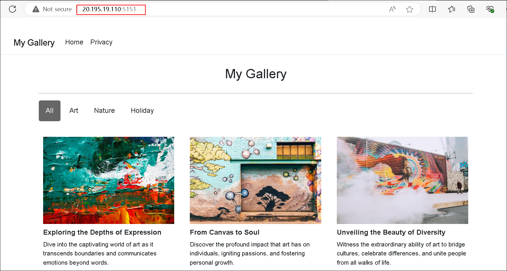

# Lab 14: Implement containerized solutions

## Lab Scenario

In this lab, you will explore how to create and deploy containers to the Container Registry using a .NET application and Docker files.

## Lab objectives

In this lab, you will perform:

+ Exercise 1: Create and run containers in Azure
+ Exercise 2: Create and run Azure container Apps service

## Estimated timing: 60 minutes

## Architecture diagram


## Lab setup and pre-requisites

Before starting this lab, you should have the following prerequisites:

- A local development setup with a text editor or IDE.
- A containerized application or source code that can be used to build a Docker image.
- A basic understanding of creating a Dockerfile.
- Familiarity with creating and using Azure Container Registry to store container images.
- **Containers**: Basic knowledge of containers and Docker, including creating and managing container images.
- **Azure Container Instance (ACI)**: Understanding of deploying and managing containers on ACI

## Exercise 1: Create and run containers in Azure

In this exercise, you will learn about creating a Container Registry, designing a Dockerfile, building a container image, and deploying a Linux container to an Azure Container Instance through hands-on experience.

### Task 1: Create a Container Registry

1. Select **+ Create a resource** in the top left corner of the page.

1. In the search bar, type **Container Registry (1)** and select **Container Registry (2)** from the results.

    

1. Select **Create (1)** and then **Container Registry (2)**.

    

1. In the **Basics** tab of the **Create Container Registry** page, fill out the following information (leave others with their default values) and then click on **Review + create (6)**

    | Setting | Action |
    | -- | -- |
    | **Subscription** text box | Leave the default value **(1)** |
    | **Resource group** section | Select **ConfidentialStack-<inject key="DeploymentID" enableCopy="false"/> (2)** |
    | **Registry name** section | enter **acr<inject key="DeploymentID" enableCopy="false"/> (3)** |
    | **Location** drop-down list | Select **<inject key="Region" enableCopy="false"/> (4)** |
    | **Pricing plan** drop-down list | Select **Basic (5)** |

         

1. Select **Create**.

   > **Note**: Wait for the deployment to complete. This can take a few minutes.

1. On the **Overview** blade, select the **Go to resource** button to navigate to the blade of the newly created container registry account.

1. On the **Container registry** blade, in the **Settings** section, select **Access keys (1)**. On the **Access keys** blade, enable the **Admin user (2)**. Copy the value of the **username (3)** box to the clipboard.

    
 
1. Open Notepad, and then paste the copied value to Notepad. You'll use this value later in this lab.

    > **Congratulations** on completing the task! Now, it's time to validate it. Here are the steps:
   - Hit the Validate button for the corresponding task.
   - If you receive a success message, you can proceed to the next task.
   - If not, carefully read the error message and retry the step, following the instructions in the lab guide.
   - If you need any assistance, please contact us at labs-support@spektrasystems.com. We are available 24/7 to help you out.
 
   <validation step="539b53c4-3443-4cad-a3e4-01b2558f894d" />

### Task 2: Create a Docker file to build a container image

1. Open the **File Explorer** window, browse to `C:\AllFiles\AZ-204-DevelopingSolutionsforMicrosoftAzure-master\Allfiles\Labs\14\Starter\webapp-lab14\`, press **Enter**.

1. Right click on the page, click on **New (1)** and select **Text document (2)**

    

1. Name the file as `Dockerfile`. 

1. Naviage to **View (1)** tab, check the box for **File name extension (2)**. Right-click on the **Dockerfile**, and select **Rename**. Remove `.txt` from **Dockerfile** **(3)**.

    

1. Click on **Yes**, to change the extension.

    

1. Make sure that **Dockerfile** does not have any extension.

1. Open the **Dockerfile** in a Notepad.

1. In the **Dockerfile**, add the following code:

    ```docker
    FROM mcr.microsoft.com/dotnet/aspnet:8.0 AS base
    WORKDIR /app
    EXPOSE 5151

    ENV ASPNETCORE_URLS=http://+:5151

    # Creates a non-root user with an explicit UID and adds permission to access the /app folder
    # For more info, please refer to https://aka.ms/vscode-docker-dotnet-configure-containers
    RUN adduser -u 5678 --disabled-password --gecos "" appuser && chown -R appuser /app
    USER appuser

    FROM mcr.microsoft.com/dotnet/sdk:8.0 AS build
    ARG configuration=Release
    WORKDIR /src
    COPY ["webapp-lab14.csproj", "./"]
    RUN dotnet restore "webapp-lab14.csproj"
    COPY . .
    WORKDIR "/src/."
    RUN dotnet build "webapp-lab14.csproj" -c $configuration -o /app/build

    FROM build AS publish
    ARG configuration=Release
    RUN dotnet publish "webapp-lab14.csproj" -c $configuration -o /app/publish /p:UseAppHost=false

    FROM base AS final
    WORKDIR /app
    COPY --from=publish /app/publish .
    ENTRYPOINT ["dotnet", "webapp-lab14.dll"]
    ```

1. Press **Ctrl+S** to save the **Dockerfile**.

Congratulations! You have successfully created a Docker file.

### Task 3: Create a Linux container on Azure using a Docker file

Make sure you have the Docker CLI installed on your local machine. If you don't have it, install it from the Docker website.

1. On the taskbar, select the **Windows Terminal** icon.

1. Search for **cmd (1)** and select **Command Prompt (2)**.

    

1. At the open command prompt, enter the following command, and then select Enter to sign in to the Azure Command-Line Interface (CLI):

    ```
    az login
    ```

     - If the **sign-in pop-up** doesn’t appear immediately, wait for **1-2 minutes**. Then, **minimize all tabs**, and you should find the pop-up on the desktop for signing in.
     - If prompted select **Work or school account** then click on **Continue**.

     - Enter the Email address and Password provided in the **Environment** tab.

     - Click on **No, sign in to this app only** to **Stay signed in to all your apps**.

1. Navigate back to the VS code, If prompted **Select a subscription and tenant (Type a number or Enter for no changes):** press **Enter**.   

1. Return to the currently open Windows terminal **Command Prompt** window. Wait for the sign-in process to finish.

1. Enter the following command, and then select Enter to change the current directory to the `C:\AllFiles\AZ-204-DevelopingSolutionsforMicrosoftAzure-master\Allfiles\Labs\14\Starter\webapp-lab14\` directory that contains the lab files:

    ```
    cd C:\AllFiles\AZ-204-DevelopingSolutionsforMicrosoftAzure-master\Allfiles\Labs\14\Starter\webapp-lab14\
    ```

1. Run the following command to upload the source code to your container registry and build the container image as a Container Registry task,
   replace `<your-registry-name>` with the name of your Container Registry:

    ```
    az acr build --registry <your-registry-name> --image webimage:latest .
    ```

         
    
      > **Note**: Wait for the build task to complete before moving forward with this lab.

2. Close the **Windows Terminal** pane.

3. Open the Azure portal and navigate to your Container Registry.

4. On the **Container registry** blade, in the **Services** section, select **Repositories**.

5. Verify that your Docker image is listed in the repository.

    

Congratulations! You have successfully created a Linux container on Azure using a Docker file.

### Task 4: Deploy Linux container image to an Azure container instance

1. On the Azure portal, select **+ Create a resource** in the top left corner of the page.

1. In the search bar, type **Container Instances (1)** and select **Container Instances (2)** from the results.

    

1. Select **+ Create (1)** and click on **Container instance (2)**.

    

1. On the **Basics** tab of the **Create Container Instance** page, fill out the following information (leave others with their default values), and then select **Next: Networking (10)**:

    | Setting | Action |
    | -- | -- |
    | **Subscription** text box | Leave the default value **(1)** |
    | **Resource group** drop-down list | Select **ConfidentialStack-<inject key="DeploymentID" enableCopy="false"/> (2)** |
    | **Container name** section | enter **aci<inject key="DeploymentID" enableCopy="false"/> (3)** |
    | **Region** drop-down list | Select **<inject key="Region" enableCopy="false"/> (4)** |
    | **Availability zones** drop-down list | Select **1 (5)** (If the region supports, otherwise not required)|
    | **Image source** section | Select **Azure Container Registry (6)** |
    | **Registry** drop-down list | Select **acr<inject key="DeploymentID" enableCopy="false"/> (7)** |
    | **Image**  drop-down list | Select **webimage (8)** |
    | **Image tag**  drop-down list | Select **latest (9)** |
    | **OS type** section | Ensure **Linux** selected  |

     

              

1. On the **Networking** tab, fill out the following information and select **Monitoring (4)** tab.

    | Setting | Action |
    | -- | -- |
    | **DNS name label** text box | Enter **dns-<inject key="DeploymentID" enableCopy="false"/> (1)** |
    | **Ports** text box | Enter **5151 (2)**, that is in your DockerFile |
    | **Ports protocol** drop-down list | Select **TCP (3)** in the list |

         

1. Uncheck the box for **Enable the container instance logs (1)** and then click on **Review + create (2)**.

    

1. Select **Create**.

   > **Note**: Wait for the deployment to complete. This can take a few minutes.

1. On the **Overview** blade, select the **Go to resource** button to navigate to the blade of the newly created container instance account.

1. Copy the public IP address of the container.

    

1. Paste it into your web browser with the port number then press enter. Replace `<public-IP-number>` with the Public IP that you have copied in the previous step.

   `<public-IP-number>:5151` or `<DNS-name>:5151`

1. You should see the web page of the .NET web application.

    

    > **Congratulations** on completing the task! Now, it's time to validate it. Here are the steps:
   - Hit the Validate button for the corresponding task.
   - If you receive a success message, you can proceed to the next task.
   - If not, carefully read the error message and retry the step, following the instructions in the lab guide.
   - If you need any assistance, please contact us at labs-support@spektrasystems.com. We are available 24/7 to help you out.
 
   <validation step="da667442-1f6c-4ae3-97e0-ec833ea3c05b" />

### Task 5: Query the container registry for existing containers

1. Open the Azure portal and navigate to your Resource Group **ConfidentialStack-<inject key="DeploymentID" enableCopy="false"/> (2)**.

1. Select the Container Registry that you created in Task 4.

1. Select the **Repositories (1)** tab and then select the repository that you want to query for existing containers. **(2)**.

    

1. In the **Tags** section, you can view the list of tags for the selected repository.

1. Select a tag to view the details of the container image. This will show you the metadata for the container image, including the size, creation date, and any associated layers.

    

1. You can also search for specific container images by using the search bar at the top of the page. Simply enter a keyword or tag name and select the **Search** button.
   
1. If you want to delete a container image, select the tag and then select the **Delete** button.
   
   > **Note**: This will permanently delete the container image and it cannot be recovered.

That's it! You have successfully learned how to query the Container Registry for existing containers.

In this exercise, you have learnt about creating a Container Registry, designing a Dockerfile, building a container image, and deploying a Linux container to an Azure Container Instance through hands-on experience.

## Exercise 2: Create and run Azure container Apps service

In this exercise, you will learn how to create a container App by using the container image that you created in exercise one.

### Task 1: Create a Container App in Azure

1. On the Azure portal, search for **Container App (1)** and select **Container App (2)** from the results.

    

1. Select **+ Create (1)** and choose **+ Contianer App (2)**.

    

1. On the **Basics** tab of the **Create Container App** page, fill out the following information (leave others with their default values), and then select **Next: Container (6)**:

    | Setting | Action |
    | -- | -- |
    | **Subscription** text box | Leave the default value **(1)** |
    | **Resource group** drop-down list | Select **ConfidentialStack-<inject key="DeploymentID" enableCopy="false"/> (2)** |
    | **Container app name** section | enter **aca<inject key="DeploymentID" enableCopy="false"/> (3)** |
    | **Region** drop-down list | Select **<inject key="Region" enableCopy="false"/> (4)** |
    | **Container Apps Environment** drop-down list | Leave the default value **(5)** |

       

         

1. On the **Container** tab, fill out the following information, and then select the **Ingress (8)** tab:

    | Setting | Action |
    | -- | -- |
    | **Use quickstart image** checkbox | uncheck **(1)** |
    | **Name** text box | Enter **aca<inject key="DeploymentID" enableCopy="false"/> (2)** |
    | **Image source** drop-down list | Select **Azure Container Registry (3)** |
    | **Registry** drop-down list | Select **acr<inject key="DeploymentID" enableCopy="false"/> .azurecr.io(4)** |
    | **Image**  drop-down list | Select **webimage (5)** |
    | **Image tag**  drop-down list | Select **latest (6)** |
    | **CPU and Memory** drop-down list | Select **0.25 CPU cores, 0.5 Gi memory (7)** in the list |

     
         

1. On the **Ingress** tab, fill out the following information and then click on **Review + create (6)**.

    | Setting | Action |
    | -- | -- |
    | **Ingress** checkbox | Select **Enable (1)** |
    | **Ingress traffic** box | Select **Accepting traffic from anywhere (2)** |
    | **Ingress type** box | Select **HTTP (3)** |
    | **Transport**  drop-down list | Select **Auto (4)** |
    | **Target port**  text box | Enter **5151 (5)** |

     

1. Then select **Create**.

    > **Note**: Wait for the deployment to complete. This can take a few minutes.

1. On the **Overview** blade, select the **Go to resource** button to navigate to the blade of the newly created container App account.

    

1. On the **Container App** blade, select the **Application Url** to see the web page of the .NET web application.

    

        

    > **Congratulations** on completing the task! Now, it's time to validate it. Here are the steps:
   - Hit the Validate button for the corresponding task.
   - If you receive a success message, you can proceed to the next task.
   - If not, carefully read the error message and retry the step, following the instructions in the lab guide.
   - If you need any assistance, please contact us at labs-support@spektrasystems.com. We are available 24/7 to help you out.
 
   <validation step="480cfb2b-068a-4eeb-a288-97b6feb524d4" />

In this exercise, you gained hands-on experience with creating a Container App and deploying a Linux container to an Azure container App.   

## Review

In this lab, you have completed:
- Create and run containers in Azure
- Create and run Azure container Apps service

## You have successfully completed this lab.
